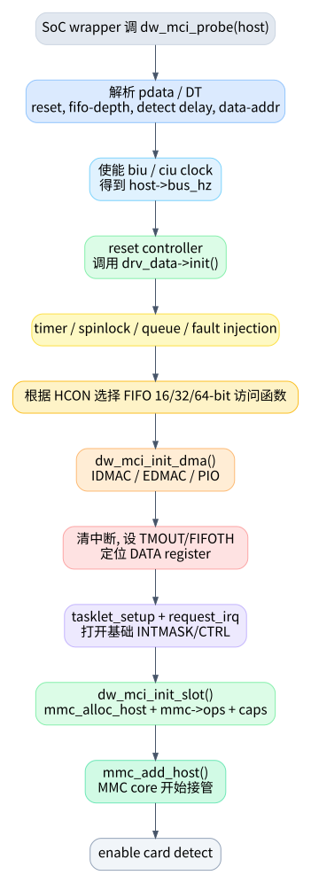

# 01. probe 与 host 注册

`dw_mci_probe()` 不是平台总线 probe 的最外层，它是 DesignWare MMC core 的公共 probe。Rockchip、Exynos 等平台 wrapper 通常负责分配 `struct dw_mci`、填充 `dev/regs/irq/drv_data/pdata` 等平台信息，然后调用这里导出的 `dw_mci_probe()`。该函数定义在 `kernel/drivers/mmc/host/dw_mmc.c:3564`，导出在 `kernel/drivers/mmc/host/dw_mmc.c:3808`。

## 1. probe 的主线

`dw_mci_probe()` 可以按初始化顺序拆成 8 步：

| 阶段 | 代码位置 | 做了什么 | 失败影响 |
|---|---:|---|---|
| 解析平台数据 | `kernel/drivers/mmc/host/dw_mmc.c:3570` | 没有 `pdata` 时从 DT 解析 reset、fifo-depth、detect delay、data-addr、low power 等 | 不能获得平台数据则 probe 失败 |
| 使能时钟 | `kernel/drivers/mmc/host/dw_mmc.c:3577` | 获取并 enable `biu`/`ciu`，计算 `host->bus_hz` | 没有 bus_hz 不能继续 |
| reset 和 SoC 初始化 | `kernel/drivers/mmc/host/dw_mmc.c:3631` | reset controller，调用 `drv_data->init()` | 平台初始化失败则退出 |
| 初始化 timer/lock/queue | `kernel/drivers/mmc/host/dw_mmc.c:3646` | 初始化 CMD11/CTO/DTO/xfer timer，spinlock，request queue | 后续状态机依赖这些对象 |
| 选择 FIFO 访问宽度 | `kernel/drivers/mmc/host/dw_mmc.c:3658` | 根据 HCON 设置 16/32/64-bit push/pull 函数 | 决定 PIO 读写函数行为 |
| reset 控制器并初始化 DMA | `kernel/drivers/mmc/host/dw_mmc.c:3689` | reset CTRL/FIFO/DMA，再 `dw_mci_init_dma()` | DMA 不可用则退到 PIO |
| 配置中断/FIFO/寄存器偏移 | `kernel/drivers/mmc/host/dw_mmc.c:3698` | 清中断、关中断、设 timeout、设 FIFOTH、定位 DATA register | 控制器基础运行条件 |
| 注册 tasklet、IRQ 和 slot | `kernel/drivers/mmc/host/dw_mmc.c:3744` | `tasklet_setup()`、`devm_request_irq()`、写 INTMASK/CTRL、`dw_mci_init_slot()` | 从此 MMC core 能看到 host |

注意一个容易忽略的顺序：tasklet 和 IRQ 在 slot 注册前已经准备好，但 `mmc_add_host()` 才真正把 host 暴露给 MMC core。slot 初始化入口是 `dw_mci_init_slot()`，定义在 `kernel/drivers/mmc/host/dw_mmc.c:3144`。

## 2. `dw_mci_init_slot()` 注册给 MMC core 的内容

`dw_mci_init_slot()` 做的是 MMC core 能理解的那部分：

1. `mmc_alloc_host()` 分配 `struct mmc_host` 和私有 `struct dw_mci_slot`，见 `kernel/drivers/mmc/host/dw_mmc.c:3150`。
2. `slot->host = host`，`host->slot = slot`，把 core 的 host 和控制器对象连起来，见 `kernel/drivers/mmc/host/dw_mmc.c:3154` 到 `kernel/drivers/mmc/host/dw_mmc.c:3159`。
3. `mmc->ops = &dw_mci_ops`，这一步决定 MMC core 后续如何调用本驱动，见 `kernel/drivers/mmc/host/dw_mmc.c:3161`。
4. 获取 regulator，解析通用 MMC DT 属性，合并平台 caps，设置 max request/segment/block 限制，见 `kernel/drivers/mmc/host/dw_mmc.c:3163` 到 `kernel/drivers/mmc/host/dw_mmc.c:3208`。
5. `mmc_add_host()` 注册 host，之后 core 可以开始 card detect、枚举和发请求，见 `kernel/drivers/mmc/host/dw_mmc.c:3212`。
6. 如果开了 debugfs，创建 `regs/req/state/pending_events/completed_events`，见 `kernel/drivers/mmc/host/dw_mmc.c:3216`。

## 3. `mmc_host_ops` 是外部入口表

如果把 `dw_mmc.c` 当作一个库，`dw_mci_ops` 就是它给 MMC core 的 API 表。定义从 `kernel/drivers/mmc/host/dw_mmc.c:1884` 开始：

| ops | 驱动函数 | 读代码时的含义 |
|---|---|---|
| `.request` | `dw_mci_request` | 核心请求入口，所有普通命令/读写最终从这里进来 |
| `.pre_req` / `.post_req` | `dw_mci_pre_req` / `dw_mci_post_req` | DMA 预映射/释放，优化连续请求 |
| `.set_ios` | `dw_mci_set_ios` | 电源、clock、bus width、timing 配置 |
| `.start_signal_voltage_switch` | `dw_mci_switch_voltage` | CMD11 后切 1.8V/3.3V 信号电压 |
| `.enable_sdio_irq` / `.ack_sdio_irq` | `dw_mci_enable_sdio_irq` / `dw_mci_ack_sdio_irq` | SDIO 中断使能和 ack |
| `.execute_tuning` | `dw_mci_execute_tuning` | 调用平台 tuning hook |
| `.card_busy` | `dw_mci_card_busy` | 读 STATUS busy bit |

因此，从 0 读这份驱动时，不要先翻所有 helper。先把 `dw_mci_ops` 里的入口标出来，每个入口代表一种来自 MMC core 的“外部事件”。

## 4. probe 后系统处于什么状态

probe 成功后：

- 控制器寄存器已经 reset，基础中断已经 unmask，见 `kernel/drivers/mmc/host/dw_mmc.c:3754`。
- tasklet 已绑定到 `dw_mci_tasklet_func()`，见 `kernel/drivers/mmc/host/dw_mmc.c:3744`。
- IRQ handler 已绑定到 `dw_mci_interrupt()`，见 `kernel/drivers/mmc/host/dw_mmc.c:3745`。
- MMC host 已通过 `mmc_add_host()` 注册，见 `kernel/drivers/mmc/host/dw_mmc.c:3212`。
- card detect 可能已经使能，见 `kernel/drivers/mmc/host/dw_mmc.c:3789`。

从这一刻开始，真正的运行时主线就是：MMC core 调 `request/set_ios/...`，硬件 IRQ 进 `dw_mci_interrupt()`，tasklet 消费事件推进请求。
