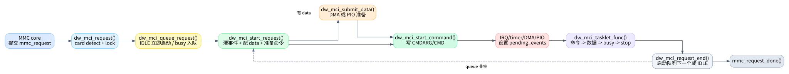

# 02. 一个 request 的生命周期

这一篇只讲一次 `mmc_request` 怎么从进入驱动到回调 `mmc_request_done()`。先不纠结所有错误分支，把正常读/写路径跑通，后面看 tasklet 状态机会轻很多。

## 1. 从 MMC core 进入：`dw_mci_request()`

MMC core 调 `.request` 后进入 `dw_mci_request()`，定义在 `kernel/drivers/mmc/host/dw_mmc.c:1469`。这个函数做三件事：

1. 通过 `mmc_priv(mmc)` 找到 `slot`，再找 `host`。
2. 检查卡是否存在；如果不存在，直接给 `mrq->cmd->error = -ENOMEDIUM` 并 `mmc_request_done()`。
3. 拿 `host->lock`，把请求交给 `dw_mci_queue_request()`。

这里还可以看到一个 Rockchip/RV1106 特例：`host->is_rv1106_sd` 时请求前会 reset 控制器，见 `kernel/drivers/mmc/host/dw_mmc.c:1490`。

## 2. 排队与立即启动：`dw_mci_queue_request()`

`dw_mci_queue_request()` 定义在 `kernel/drivers/mmc/host/dw_mmc.c:1441`。它是“控制器级串行化”的入口。逻辑很简单：

| 当前状态 | 行为 |
|---|---|
| `STATE_IDLE` | 设置 `STATE_SENDING_CMD`，立即 `dw_mci_start_request()` |
| 其他状态 | 把 slot 挂到 `host->queue`，等当前请求结束后再启动 |
| `STATE_WAITING_CMD11_DONE` | 打 warning，并尽量恢复到 `STATE_IDLE` 后继续 |

这说明 `dw_mmc.c` 的请求状态机一次只处理一个 active request。排队发生在 host 层，不是每个状态都能并发推进。

## 3. 选择首个命令：`sbc` 优先

`dw_mci_start_request()` 很短，定义在 `kernel/drivers/mmc/host/dw_mmc.c:1430`。它只做一件重要的事：如果 request 有 `mrq->sbc`，先发 `sbc`；否则发 `mrq->cmd`。

`sbc` 是 set block count 命令。tasklet 后面会在 `sbc` 成功完成时重新调用 `__dw_mci_start_request()` 去发真正的 `mrq->cmd`，对应分支在 `kernel/drivers/mmc/host/dw_mmc.c:2204`。

## 4. 真正启动请求：`__dw_mci_start_request()`

`__dw_mci_start_request()` 定义在 `kernel/drivers/mmc/host/dw_mmc.c:1363`。它是一次 request 的启动核心，可以按顺序读：

| 顺序 | 代码位置 | 做了什么 |
|---:|---:|---|
| 1 | `kernel/drivers/mmc/host/dw_mmc.c:1373` | `host->mrq = mrq`，清空 `pending_events/completed_events/cmd_status/data_status/dir_status` |
| 2 | `kernel/drivers/mmc/host/dw_mmc.c:1384` | 如果命令带 data，设置 `TMOUT/BYTCNT/BLKSIZ` |
| 3 | `kernel/drivers/mmc/host/dw_mmc.c:1394` | `dw_mci_prepare_command()` 组装 CMDR bits |
| 4 | `kernel/drivers/mmc/host/dw_mmc.c:1400` | 有 data 时先 `dw_mci_submit_data()` 准备 DMA/PIO |
| 5 | `kernel/drivers/mmc/host/dw_mmc.c:1405` | `dw_mci_start_command()` 写 CMDARG/CMD，真正启动硬件命令 |
| 6 | `kernel/drivers/mmc/host/dw_mmc.c:1407` | CMD11 特殊 timer |
| 7 | `kernel/drivers/mmc/host/dw_mmc.c:1427` | 预先计算 stop/abort 命令寄存器值 |

一个关键点：有数据的请求会先准备 data path，再发 command。原因是命令一旦被控制器接受，数据中断/DMA 可能很快发生；驱动必须提前把 DMA/PIO/FIFO 环境布好。

## 5. 命令是如何启动的

`dw_mci_prepare_command()` 在 `kernel/drivers/mmc/host/dw_mmc.c:283`。它根据 opcode、response 类型、是否带 data、是否需要 stop、是否 CMD11 来设置 CMDR bits。

`dw_mci_start_command()` 在 `kernel/drivers/mmc/host/dw_mmc.c:428`。它把 `host->cmd` 指向当前命令，写 `CMDARG`，等待控制器不 busy，写 `CMD | START`。如果命令期待 response，还会启动 command timeout timer，见 `kernel/drivers/mmc/host/dw_mmc.c:442`。

命令完成后，IRQ 或 CTO timer 会设置 `EVENT_CMD_COMPLETE`。tasklet 消费后调用 `dw_mci_command_complete()`，读取 response 并把 RTO/RCRC/RESP_ERR 转换成 `cmd->error`，见 `kernel/drivers/mmc/host/dw_mmc.c:2004`。

## 6. 请求如何结束：`dw_mci_request_end()`

`dw_mci_request_end()` 定义在 `kernel/drivers/mmc/host/dw_mmc.c:1967`。它是所有成功/失败路径最终汇合点。核心逻辑：

1. 当前 request 已经没有 `host->cmd` 和 `host->data`，否则 `WARN_ON`。
2. 如果队列非空，取下一个 slot，设置 `STATE_SENDING_CMD`，直接启动下一个 request，见 `kernel/drivers/mmc/host/dw_mmc.c:1980`。
3. 如果队列为空，普通情况回 `STATE_IDLE`；如果刚完成的是 CMD11，则进入 `STATE_WAITING_CMD11_DONE`，见 `kernel/drivers/mmc/host/dw_mmc.c:1992`。
4. 解锁后调用 `mmc_request_done(prev_mmc, mrq)`，再重新加锁，见 `kernel/drivers/mmc/host/dw_mmc.c:1998`。

解锁再回调是必要的：`mmc_request_done()` 可能触发上层继续提交请求，驱动不能在持有 host lock 时把控制权交回 MMC core。

## 7. 三条最常见请求路径

| 请求类型 | 主路径 |
|---|---|
| 无数据命令 | `request -> queue -> start command -> EVENT_CMD_COMPLETE -> command_complete -> request_end` |
| 正常读/写 | `request -> submit_data -> start command -> CMD complete -> SENDING_DATA -> XFER complete -> DATA_BUSY -> DATA complete -> request_end/stop` |
| 多块读写带 stop | 正常数据路径完成后，若需要 `data->stop` 且不是 `sbc` 请求，发送 stop/abort，进入 `STATE_SENDING_STOP`，等待 stop 命令完成后 `request_end` |

读 tasklet 时，把这三条路径放在脑子里，复杂分支就容易归位：它们不是随意跳转，而是在处理命令失败、数据失败、stop 失败、CMD11 这几个例外。
