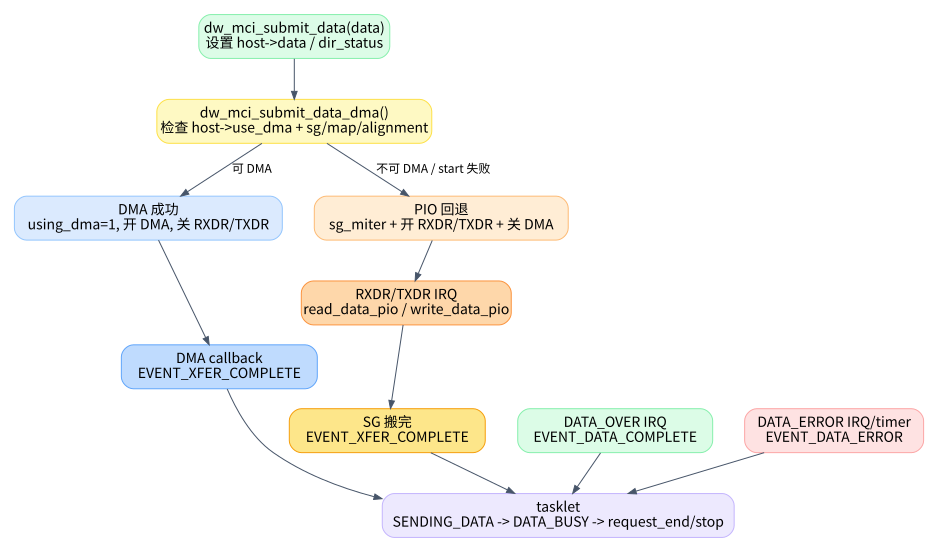

# 03. 数据路径：DMA、PIO 与 FIFO

数据路径是 `dw_mmc.c` 里最容易和状态机混在一起的部分。先抓住一个原则：`dw_mci_submit_data()` 只是把“怎么搬数据”准备好，真正判断“请求是否结束”仍然在 tasklet 里。

## 1. 数据请求启动前做了什么

有 data 的命令在 `__dw_mci_start_request()` 里先设置数据相关寄存器，再发命令。关键代码在 `kernel/drivers/mmc/host/dw_mmc.c:1384` 到 `kernel/drivers/mmc/host/dw_mmc.c:1405`：

- `dw_mci_set_data_timeout()` 根据 `data->timeout_ns` 配 TMOUT。
- `BYTCNT = blksz * blocks`，`BLKSIZ = blksz`。
- `dw_mci_submit_data()` 设置 DMA/PIO。
- 最后才 `dw_mci_start_command()`。

这个顺序说明 data path 是命令启动前的准备工作，不是命令完成后才开始配置。

## 2. DMA 预映射：`pre_req/post_req`

`dw_mci_pre_req()` 和 `dw_mci_post_req()` 是 `mmc_host_ops` 暴露给 core 的优化入口，定义在 `kernel/drivers/mmc/host/dw_mmc.c:960` 和 `kernel/drivers/mmc/host/dw_mmc.c:977`。

`pre_req` 会尝试提前 `dma_map_sg()`，成功则把 `data->host_cookie` 标成 `COOKIE_PRE_MAPPED`。真正请求开始时，`dw_mci_pre_dma_transfer()` 如果发现已经 pre-mapped，就直接返回 `sg_len`，见 `kernel/drivers/mmc/host/dw_mmc.c:929`。

这层优化不改变状态机，只减少请求开始时的 DMA mapping 成本。

## 3. DMA 选择与失败回退

`dw_mci_init_dma()` 在 probe 阶段根据 HCON 选择 IDMAC、EDMAC 或 PIO，定义在 `kernel/drivers/mmc/host/dw_mmc.c:3235`。大意是：

| HCON transfer mode | 驱动内部模式 | 说明 |
|---|---|---|
| internal DMA | `TRANS_MODE_IDMAC` | 使用控制器内部 IDMAC descriptor ring |
| DW DMA / generic DMA | `TRANS_MODE_EDMAC` | 使用外部 DMA engine channel |
| no usable DMA | `TRANS_MODE_PIO` | CPU 通过 FIFO 读写 |

真正每次请求是否走 DMA，在 `dw_mci_submit_data_dma()` 里决定，定义在 `kernel/drivers/mmc/host/dw_mmc.c:1128`。它会：

1. 检查 `host->use_dma`，没有 DMA 则返回失败。
2. 调 `dw_mci_pre_dma_transfer()` 检查长度、block size、SG offset/length 是否适合 DMA，见 `kernel/drivers/mmc/host/dw_mmc.c:922`。
3. 设置 `host->using_dma = 1`。
4. 调整 FIFO watermark，打开 `SDMMC_CTRL_DMA_ENABLE`，屏蔽 RXDR/TXDR PIO 中断。
5. 调 `dma_ops->start()`。如果 start 失败，停止 DMA 并让当前请求回退 PIO，见 `kernel/drivers/mmc/host/dw_mmc.c:1175`。

因此，`host->use_dma` 表示这个 host 支持哪种 DMA，`host->using_dma` 表示当前 request 是否真的在用 DMA。这两个字段不能混为一谈。

## 4. PIO 路径做了什么

当 `dw_mci_submit_data_dma()` 失败时，`dw_mci_submit_data()` 进入 PIO 分支，定义在 `kernel/drivers/mmc/host/dw_mmc.c:1187`。

PIO 分支会启动 SG iterator，设置 `host->sg`，清 partial buffer，打开 RXDR/TXDR 中断，关闭 `SDMMC_CTRL_DMA_ENABLE`，并恢复 PIO 用的 FIFOTH，见 `kernel/drivers/mmc/host/dw_mmc.c:1206` 到 `kernel/drivers/mmc/host/dw_mmc.c:1239`。

真正搬数据的是 IRQ handler 调用的两个函数：

- 读：`dw_mci_read_data_pio()`，定义在 `kernel/drivers/mmc/host/dw_mmc.c:2810`。它根据 FIFO count 从 FIFO 拉数据，更新 `data->bytes_xfered`。
- 写：`dw_mci_write_data_pio()`，定义在 `kernel/drivers/mmc/host/dw_mmc.c:2866`。它根据 FIFO 剩余空间往 FIFO 推数据，更新 `data->bytes_xfered`。

PIO 读写完成 SG 后，会设置 `EVENT_XFER_COMPLETE`。读路径在 `kernel/drivers/mmc/host/dw_mmc.c:2861`，写路径在 `kernel/drivers/mmc/host/dw_mmc.c:2917`。

## 5. DMA 完成只代表内存侧搬完

DMA callback 是 `dw_mci_dmac_complete_dma()`，定义在 `kernel/drivers/mmc/host/dw_mmc.c:510`。它做 cleanup，然后设置 `EVENT_XFER_COMPLETE` 并 schedule tasklet，见 `kernel/drivers/mmc/host/dw_mmc.c:532`。

这个事件名字容易误导：`XFER_COMPLETE` 不是整个 MMC data transaction 完成，只是驱动认为内存/FIFO/DMA 这侧 transfer 已完成。卡侧是否真正 data over，要等主控制器中断 `SDMMC_INT_DATA_OVER`，IRQ handler 在 `kernel/drivers/mmc/host/dw_mmc.c:3005` 设置 `EVENT_DATA_COMPLETE`。

这就是 tasklet 里为什么有两个状态：

| 状态 | 等待事件 | 意义 |
|---|---|---|
| `STATE_SENDING_DATA` | `EVENT_XFER_COMPLETE` | 等内存侧/DMA/PIO 搬完 |
| `STATE_DATA_BUSY` | `EVENT_DATA_COMPLETE` | 等卡侧 data over，确认 data status |

如果把这两个事件合成一个“data done”，状态机会立刻变得难懂。

## 6. `dw_mci_data_complete()` 只在 data over 后判断最终 data error

`dw_mci_data_complete()` 定义在 `kernel/drivers/mmc/host/dw_mmc.c:2037`。它读取 `host->data_status`，根据 DRTO/DCRC/EBE/SBE 映射成 `data->error`。没有错误时设置 `data->bytes_xfered = blocks * blksz`。

这也解释了一个现象：PIO/DMA 路径可能已经更新过 `bytes_xfered`，但最终成功时 `dw_mci_data_complete()` 会按完整块数覆盖为全量。错误时则根据错误类型处理，必要时 reset 控制器清 FIFO，见 `kernel/drivers/mmc/host/dw_mmc.c:2070`。

## 7. 读数据路径时的检查清单

排查“数据没回来”时，不要只盯着 tasklet 状态。按下面顺序看：

1. 当前请求是否有 `data`，`BYTCNT/BLKSIZ` 是否设置。
2. `host->use_dma` 是 IDMAC、EDMAC 还是 PIO。
3. 当前请求 `host->using_dma` 是否为 1。
4. 如果 DMA，callback 有没有设置 `EVENT_XFER_COMPLETE`。
5. 如果 PIO，RXDR/TXDR 中断是否持续触发，`host->sg` 是否走到 NULL。
6. `EVENT_XFER_COMPLETE` 和 `EVENT_DATA_COMPLETE` 哪一个缺失。
7. `host->data_status` 是否带 DRTO/DCRC/EBE/SBE。
