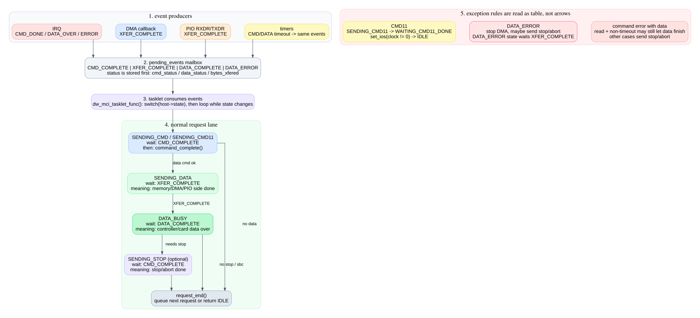
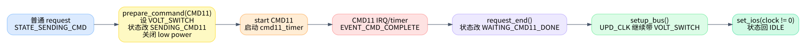

# 04. IRQ/timer/tasklet 状态机

这一篇是整个系列的核心。重点不是画出所有箭头，而是把状态机拆成“事件生产者”和“事件消费者”。`dw_mci_interrupt()`、DMA callback、PIO 函数、timer 都只负责设置事件位；`dw_mci_tasklet_func()` 才根据当前状态消费事件并推进请求。

## 1. 事件位是 IRQ/timer 与 tasklet 之间的邮箱

事件定义在 `kernel/drivers/mmc/host/dw_mmc.h:32`：

| 事件 | 生产者 | tasklet 中的含义 |
|---|---|---|
| `EVENT_CMD_COMPLETE` | CMD_DONE IRQ、command error IRQ、CTO timer、CMD11 timer | 当前命令有结果了，读取 response/status 并决定下一步 |
| `EVENT_XFER_COMPLETE` | DMA callback、PIO SG 搬完、错误 stop DMA | 内存侧 transfer 完成，可以进入/继续 data busy 收尾 |
| `EVENT_DATA_COMPLETE` | DATA_OVER IRQ、部分 timeout/quirk 路径 | 控制器/卡侧 data over，可以调用 `dw_mci_data_complete()` |
| `EVENT_DATA_ERROR` | data error IRQ、DTO/xfer timer、fault injection | 数据路径出错，先 stop/abort 或 reset，再收尾 |

头文件注释强调了顺序要求：设置事件位前必须先更新 `cmd_status`、`data_status` 或 `bytes_xfered`，并用 barrier 保证可见性，见 `kernel/drivers/mmc/host/dw_mmc.h:146` 到 `kernel/drivers/mmc/host/dw_mmc.h:157`。

## 2. IRQ handler 负责把硬件中断翻译成事件

`dw_mci_interrupt()` 定义在 `kernel/drivers/mmc/host/dw_mmc.c:2943`。它先读 `MINTSTS`，再分块处理：

| 硬件信号 | 代码位置 | 事件 |
|---|---:|---|
| CMD11 voltage switch interrupt | `kernel/drivers/mmc/host/dw_mmc.c:2951` | 当作 CMD complete，并删除 CMD11 timer |
| command error | `kernel/drivers/mmc/host/dw_mmc.c:2969` | 写 `cmd_status`，设置 `EVENT_CMD_COMPLETE` |
| data error | `kernel/drivers/mmc/host/dw_mmc.c:2983` | 写 `data_status`，设置 `EVENT_DATA_ERROR`，部分 quirk 还设置 `EVENT_DATA_COMPLETE` |
| data over | `kernel/drivers/mmc/host/dw_mmc.c:3005` | 写 `data_status`，PIO 读尾部数据，设置 `EVENT_DATA_COMPLETE` |
| RXDR/TXDR | `kernel/drivers/mmc/host/dw_mmc.c:3027` | PIO 读/写 FIFO，SG 完成时由 PIO 函数设置 `EVENT_XFER_COMPLETE` |
| CMD_DONE | `kernel/drivers/mmc/host/dw_mmc.c:3039` | 调 `dw_mci_cmd_interrupt()`，设置 `EVENT_CMD_COMPLETE` |
| IDMAC RI/TI | `kernel/drivers/mmc/host/dw_mmc.c:3062` | DMA complete callback 设置 `EVENT_XFER_COMPLETE` |

`dw_mci_cmd_interrupt()` 本身很短：删除 command timeout timer，保存 `cmd_status`，设置 `EVENT_CMD_COMPLETE`，schedule tasklet，见 `kernel/drivers/mmc/host/dw_mmc.c:2920`。

## 3. timer 也只是制造同类事件

timer 的好处是它不引入第二套状态机。它们超时后仍然设置同样的事件，让 tasklet 走同一套收尾逻辑。

| timer | 定义位置 | 触发条件 | 制造的事件 |
|---|---:|---|---|
| `cmd11_timer` | `kernel/drivers/mmc/host/dw_mmc.c:3326` | CMD11 长时间没有完成 | `cmd_status = RTO`，`EVENT_CMD_COMPLETE` |
| `cto_timer` | `kernel/drivers/mmc/host/dw_mmc.c:3340` | 普通命令/stop 命令没有 CMD_DONE | `cmd_status = RTO`，`EVENT_CMD_COMPLETE` |
| `xfer_timer` | `kernel/drivers/mmc/host/dw_mmc.c:3395` | `STATE_SENDING_DATA` 太久没有 xfer complete | `data_status = DRTO`，`EVENT_DATA_ERROR + EVENT_DATA_COMPLETE` |
| `dto_timer` | `kernel/drivers/mmc/host/dw_mmc.c:3425` | data over 太久没来 | `data_status = DRTO`，`EVENT_DATA_ERROR + EVENT_DATA_COMPLETE` |

理解这一点后，timeout 路径就不需要单独画一张巨图：它和 IRQ 路径最终都会进入 tasklet 的同一组分支。

## 4. tasklet 总体结构

`dw_mci_tasklet_func()` 定义在 `kernel/drivers/mmc/host/dw_mmc.c:2171`。它拿 `host->lock`，读取 `host->state`、`host->data`、`host->mrq`，然后用 `do { prev_state = state; switch (state) ... } while (state != prev_state)` 做有限状态推进，见 `kernel/drivers/mmc/host/dw_mmc.c:2181` 到 `kernel/drivers/mmc/host/dw_mmc.c:2414`。

这个循环的意义是：如果一个事件消费后可以立刻进入下一个状态，并且下一个状态的事件已经就绪，就在同一次 tasklet 里继续推进；否则保存 `host->state = state`，等下一次 IRQ/timer 再进来。

## 5. 状态转移表：正常路径

| 当前状态 | 等什么 | 做什么 | 下一步 |
|---|---|---|---|
| `STATE_IDLE` | 无 | 空闲态不处理事件 | 保持 |
| `STATE_SENDING_CMD` | `EVENT_CMD_COMPLETE` | `dw_mci_command_complete()`，清 `host->cmd` | 无 data 或命令错误则 `request_end`；有 data 且成功则 `STATE_SENDING_DATA` |
| `STATE_SENDING_DATA` | `EVENT_XFER_COMPLETE` | 标记 transfer complete | 无 late data error 则 `STATE_DATA_BUSY` |
| `STATE_DATA_BUSY` | `EVENT_DATA_COMPLETE` | `dw_mci_data_complete()`，清 `host->data` | 不需要 stop 则 `request_end`；需要 stop 则发 stop 并进 `STATE_SENDING_STOP` |
| `STATE_SENDING_STOP` | `EVENT_CMD_COMPLETE` | 完成 stop 命令，必要时 reset | `request_end` |

正常读/写路径对应代码：命令完成分支从 `kernel/drivers/mmc/host/dw_mmc.c:2195` 开始，data transfer 分支从 `kernel/drivers/mmc/host/dw_mmc.c:2252` 开始，data busy 分支从 `kernel/drivers/mmc/host/dw_mmc.c:2319` 开始，stop 分支从 `kernel/drivers/mmc/host/dw_mmc.c:2386` 开始。

## 6. 状态转移表：命令阶段分支

| 条件 | 代码位置 | 结果 |
|---|---:|---|
| 没有 `EVENT_CMD_COMPLETE` | `kernel/drivers/mmc/host/dw_mmc.c:2197` | 停在 `SENDING_CMD/SENDING_CMD11` |
| 当前命令是 `mrq->sbc` 且成功 | `kernel/drivers/mmc/host/dw_mmc.c:2204` | 立即启动真正的 `mrq->cmd`，不结束 request |
| 命令带 data 且出错，非 timeout，方向是读 | `kernel/drivers/mmc/host/dw_mmc.c:2210` | 进入 `STATE_SENDING_DATA`，让可能已经开始的数据读完，避免竞态 |
| 命令带 data 且出错，其他情况 | `kernel/drivers/mmc/host/dw_mmc.c:2238` | 发送 stop/abort，停止 DMA，进入 `STATE_SENDING_STOP` |
| 命令无 data 或命令出错无需继续 data | `kernel/drivers/mmc/host/dw_mmc.c:2244` | `dw_mci_request_end()` |
| 命令带 data 且成功 | `kernel/drivers/mmc/host/dw_mmc.c:2249` | 进入 `STATE_SENDING_DATA` |

最反直觉的是“读方向 response CRC error 仍然进入 data state”。源码注释解释得很直白：控制器可能已经进入数据传输状态，强行 stop 反而容易制造竞态，所以让数据路径自然收尾再处理。

## 7. 状态转移表：数据阶段分支

`STATE_SENDING_DATA` 等的是 `EVENT_XFER_COMPLETE`，但会优先检查 `EVENT_DATA_ERROR`：

| 条件 | 代码位置 | 结果 |
|---|---:|---|
| 先看到 `EVENT_DATA_ERROR` | `kernel/drivers/mmc/host/dw_mmc.c:2261` | 需要时发 stop/abort，停止 DMA，进 `STATE_DATA_ERROR` |
| 写方向数据错误 | `kernel/drivers/mmc/host/dw_mmc.c:2268` | 直接设置 `bytes_xfered = 0`、`data->error = -ETIMEDOUT`，结束 request |
| 没有 `EVENT_XFER_COMPLETE` | `kernel/drivers/mmc/host/dw_mmc.c:2278` | 根据方向启动 DTO/xfer timer，继续等 |
| 有 `EVENT_XFER_COMPLETE` 后又发现 late data error | `kernel/drivers/mmc/host/dw_mmc.c:2306` | 发 stop/abort，停止 DMA，进 `STATE_DATA_ERROR` |
| transfer complete 且无 data error | `kernel/drivers/mmc/host/dw_mmc.c:2315` | 进入 `STATE_DATA_BUSY` |

`STATE_DATA_ERROR` 很小：它只等 `EVENT_XFER_COMPLETE`，等到了就转 `STATE_DATA_BUSY`，见 `kernel/drivers/mmc/host/dw_mmc.c:2406`。这说明 data error 后仍要让 transfer complete 和 data complete 两侧尽量对齐，避免漏收尾。

## 8. 状态转移表：data busy 与 stop

`STATE_DATA_BUSY` 等 `EVENT_DATA_COMPLETE`，然后调用 `dw_mci_data_complete()` 判断最终 data status。

| 条件 | 代码位置 | 结果 |
|---|---:|---|
| 没有 `EVENT_DATA_COMPLETE` | `kernel/drivers/mmc/host/dw_mmc.c:2320` | 按需启动 DTO/xfer timer，继续等 |
| data 成功，且无 stop 或已有 sbc | `kernel/drivers/mmc/host/dw_mmc.c:2338` | `request_end` |
| data 成功，且需要 stop | `kernel/drivers/mmc/host/dw_mmc.c:2347` | 发送 stop/abort，进入 `STATE_SENDING_STOP` |
| data 失败，且没有 pending command complete | `kernel/drivers/mmc/host/dw_mmc.c:2370` | 清 `host->cmd`，直接 `request_end` |
| data 失败，但已经有 stop/cmd complete | `kernel/drivers/mmc/host/dw_mmc.c:2382` | 进入 `STATE_SENDING_STOP` 继续完成 stop 收尾 |

`STATE_SENDING_STOP` 等 `EVENT_CMD_COMPLETE`。如果原始 data command 已经有命令错误，会 reset 控制器，见 `kernel/drivers/mmc/host/dw_mmc.c:2390`。然后完成 stop 命令并 `request_end()`。

## 9. CMD11 特殊路径

CMD11 是 SD 3.0 voltage switch。它不只是普通命令，因为 CMD11 完成后还要配合电压/clock 切换。路径如下：

关键点：

1. `dw_mci_prepare_command()` 发现 opcode 是 `SD_SWITCH_VOLTAGE`，设置 `SDMMC_CMD_VOLT_SWITCH`，并把状态从 `STATE_SENDING_CMD` 改成 `STATE_SENDING_CMD11`，见 `kernel/drivers/mmc/host/dw_mmc.c:301`。
2. `__dw_mci_start_request()` 给 CMD11 启动一个更长的 `cmd11_timer`，见 `kernel/drivers/mmc/host/dw_mmc.c:1407`。
3. CMD11 完成后走普通 `EVENT_CMD_COMPLETE` 分支，最终 `dw_mci_request_end()` 发现当前状态是 `STATE_SENDING_CMD11`，把状态设为 `STATE_WAITING_CMD11_DONE`，见 `kernel/drivers/mmc/host/dw_mmc.c:1992`。
4. 后续 `dw_mci_setup_bus()` 在 `STATE_WAITING_CMD11_DONE` 时继续带 `SDMMC_CMD_VOLT_SWITCH` 更新 clock，见 `kernel/drivers/mmc/host/dw_mmc.c:1258`。
5. `dw_mci_set_ios()` 在 clock 非 0 时把状态恢复到 `STATE_IDLE`，见 `kernel/drivers/mmc/host/dw_mmc.c:1620`。

所以 CMD11 不是 tasklet 单独能解释完的状态，它跨了 request、state machine、clock setup、set_ios 四个位置。

## 10. 读状态机的最短口诀

先看当前状态，再看它等哪个事件；事件没到就停，事件到了才看错误码。命令错看 `cmd_status`，数据错看 `data_status`，数据路径一定区分 `XFER_COMPLETE` 和 `DATA_COMPLETE`，CMD11 一定跨到 `set_ios()` 才算真正收尾。
