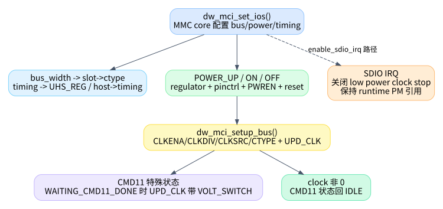

# 05. 时钟、电源、CMD11 与 SDIO IRQ

这一篇讲不直接属于 request 的路径，但它们会影响 request 状态机：`set_ios()`、`setup_bus()`、信号电压切换、SDIO IRQ、runtime PM。很多“状态机为什么卡住”的问题，其实根在 clock/power/low-power mode。

## 1. `dw_mci_set_ios()` 是 MMC core 配置硬件状态的主入口

`dw_mci_set_ios()` 定义在 `kernel/drivers/mmc/host/dw_mmc.c:1498`，由 `mmc_host_ops.set_ios` 暴露给 MMC core，ops 表在 `kernel/drivers/mmc/host/dw_mmc.c:1888`。

它按顺序处理：

| 内容 | 代码位置 | 说明 |
|---|---:|---|
| bus width | `kernel/drivers/mmc/host/dw_mmc.c:1505` | 根据 1/4/8-bit 设置 `slot->ctype` |
| timing/DDR | `kernel/drivers/mmc/host/dw_mmc.c:1517` | 修改 `UHS_REG` DDR bit，保存 `host->timing` |
| clock mirror | `kernel/drivers/mmc/host/dw_mmc.c:1530` | `slot->clock = ios->clock`，避免 core 更新竞态 |
| 平台 set_ios hook | `kernel/drivers/mmc/host/dw_mmc.c:1536` | SoC 私有配置入口 |
| power mode | `kernel/drivers/mmc/host/dw_mmc.c:1539` | `POWER_UP/ON/OFF` 分别处理 regulator、pinctrl、reset、clock |
| CMD11 收尾状态 | `kernel/drivers/mmc/host/dw_mmc.c:1620` | `WAITING_CMD11_DONE` 且 clock 非 0 时回 `IDLE` |

`set_ios()` 不是简单设置寄存器。它既处理电源，也处理 pinctrl、reset、clock、timing，还会影响 CMD11 状态机。

## 2. `dw_mci_setup_bus()` 的 clock 更新顺序

`dw_mci_setup_bus()` 定义在 `kernel/drivers/mmc/host/dw_mmc.c:1250`。它的核心流程是：

1. 如果当前处于 `STATE_WAITING_CMD11_DONE`，clock update 命令继续带 `SDMMC_CMD_VOLT_SWITCH`，见 `kernel/drivers/mmc/host/dw_mmc.c:1258`。
2. clock 为 0 时，关闭 `CLKENA` 并通知 CIU，见 `kernel/drivers/mmc/host/dw_mmc.c:1264`。
3. clock 改变或强制初始化时，先 disable clock，再清 `CLKSRC`，发 `UPD_CLK`。
4. 写 `CLKDIV`，再发 `UPD_CLK`。
5. 重新 enable clock，并根据 `DW_MMC_CARD_NO_LOW_PWR` 决定是否开 low power clock stop，见 `kernel/drivers/mmc/host/dw_mmc.c:1311`。
6. 更新 `slot->__clk_old`、`mmc->actual_clock`、`host->current_speed`，最后写 `CTYPE`。

这个函数会频繁通过 `mci_send_cmd(slot, SDMMC_CMD_UPD_CLK | SDMMC_CMD_PRV_DAT_WAIT, 0)` 通知 CIU。它不是普通 MMC 命令路径，不走 `mmc_request`，但会直接操作控制器命令寄存器。

## 3. CMD11 为什么跨多个函数

CMD11 的完整链路：

| 阶段 | 代码位置 | 做什么 |
|---|---:|---|
| 准备命令 | `kernel/drivers/mmc/host/dw_mmc.c:301` | 设置 `SDMMC_CMD_VOLT_SWITCH`，状态改 `STATE_SENDING_CMD11`，临时关闭 low power mode |
| 启动命令 | `kernel/drivers/mmc/host/dw_mmc.c:1407` | 设置 500ms 级 CMD11 timer |
| IRQ 特判 | `kernel/drivers/mmc/host/dw_mmc.c:2951` | voltage switch interrupt 先处理，避免被当成普通错误 |
| request 收尾 | `kernel/drivers/mmc/host/dw_mmc.c:1992` | 从 `STATE_SENDING_CMD11` 进入 `STATE_WAITING_CMD11_DONE` |
| clock update | `kernel/drivers/mmc/host/dw_mmc.c:1258` | `setup_bus()` 继续带 `VOLT_SWITCH` bit |
| set_ios 收尾 | `kernel/drivers/mmc/host/dw_mmc.c:1620` | clock 非 0 后回 `STATE_IDLE` |

所以看到 `STATE_WAITING_CMD11_DONE` 不要误以为 tasklet 在等一个事件。它等的是后续 IOS/clock 流程把电压切换协议走完。

## 4. SDIO IRQ 与 low power mode

SDIO interrupt 的处理也会改 clock low power 行为。`dw_mci_prepare_sdio_irq()` 定义在 `kernel/drivers/mmc/host/dw_mmc.c:1722`。注释说明：低功耗模式会在 idle 时停 card clock，但 SDIO interrupt 需要 clock 工作，所以使能 SDIO IRQ 时要关闭 low power clock stop。

入口 `dw_mci_enable_sdio_irq()` 定义在 `kernel/drivers/mmc/host/dw_mmc.c:1770`，它做三件事：

1. 调 `dw_mci_prepare_sdio_irq()` 修改 `CLKENA` low-power bit。
2. 调 `__dw_mci_enable_sdio_irq()` 修改 `INTMASK` 中对应 slot 的 SDIO interrupt bit，见 `kernel/drivers/mmc/host/dw_mmc.c:1751`。
3. SDIO IRQ 使能时 `pm_runtime_get_noresume()`，关闭时 `pm_runtime_put_noidle()`，避免设备在需要接收 SDIO interrupt 时 runtime suspend。

主 IRQ 中看到 SDIO interrupt 时，会清中断、临时 disable 对应 SDIO IRQ，然后 `sdio_signal_irq()` 通知 core，见 `kernel/drivers/mmc/host/dw_mmc.c:3053`。core ack 后再通过 `.ack_sdio_irq` 重新 enable，入口是 `dw_mci_ack_sdio_irq()`，见 `kernel/drivers/mmc/host/dw_mmc.c:1785`。

## 5. reset 与 runtime PM 对状态机的影响

`dw_mci_reset()` 定义在 `kernel/drivers/mmc/host/dw_mmc.c:1817`。它会 stop SG iterator、reset CTRL/FIFO/DMA、清中断、等待 DMA_REQ 消失、必要时重新初始化 IDMAC，并最后发 `SDMMC_CMD_UPD_CLK`。错误路径里调用 reset 不是“重启整个驱动”，而是把控制器内部 FIFO/DMA/中断状态拉回可控状态。

runtime PM resume 会重新初始化 DMA、reset 控制器、恢复 `FIFOTH/TMOUT/INTMASK/CTRL` 等，再对 keep-power 场景调用 `set_ios()` 或强制 `setup_bus()`。相关代码从 `kernel/drivers/mmc/host/dw_mmc.c:3835` 开始，其中恢复 clock/bus 的关键调用在 `kernel/drivers/mmc/host/dw_mmc.c:3906` 和 `kernel/drivers/mmc/host/dw_mmc.c:3909`。

## 6. 排查 clock/power 类问题的切入点

如果现象是“命令不完成”或“SDIO IRQ 丢”，不要只看 request 状态机。同步检查：

- `set_ios()` 是否把 `slot->clock` 设置为预期值。
- `setup_bus()` 后 `CLKENA/CLKDIV/CTYPE` 是否符合预期。
- CMD11 后是否停在 `STATE_WAITING_CMD11_DONE`，以及后续 `set_ios()` 是否被调用。
- SDIO IRQ 使能时是否设置 `DW_MMC_CARD_NO_LOW_PWR` 并保持 runtime PM 引用。
- 错误恢复是否 reset 后重新发了 `UPD_CLK`。
