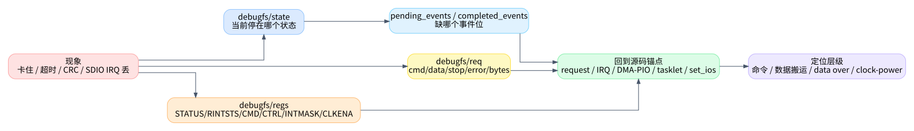

# 06. 调试与读代码方法

这一篇给实际排障用。目标不是列所有寄存器，而是帮助你把现象快速映射到 `dw_mmc.c` 的几条路径：request 入口、事件生产者、tasklet 消费者、数据路径、clock/power 路径。

## 1. debugfs 能直接看到的东西

如果内核启用了 `CONFIG_DEBUG_FS`，`dw_mci_init_debugfs()` 会创建调试节点，定义在 `kernel/drivers/mmc/host/dw_mmc.c:193`。

| 节点 | 创建位置 | 用途 |
|---|---:|---|
| `regs` | `kernel/drivers/mmc/host/dw_mmc.c:203` | 读 `STATUS/RINTSTS/CMD/CTRL/INTMASK/CLKENA` |
| `req` | `kernel/drivers/mmc/host/dw_mmc.c:204` | 打印当前 request 的 cmd/data/stop/error/bytes |
| `state` | `kernel/drivers/mmc/host/dw_mmc.c:205` | 当前 tasklet 状态机状态值 |
| `pending_events` | `kernel/drivers/mmc/host/dw_mmc.c:206` | IRQ/timer 已投递、tasklet 待消费的事件位 |
| `completed_events` | `kernel/drivers/mmc/host/dw_mmc.c:208` | tasklet 已消费的事件位 |
| `fail_data_crc` | `kernel/drivers/mmc/host/dw_mmc.c:210` | fault injection 场景下可注入 data CRC 错误 |

状态值按 `enum dw_mci_state` 解码，定义在 `kernel/drivers/mmc/host/dw_mmc.h:21`。事件 bit 按 `EVENT_CMD_COMPLETE = 0`、`EVENT_XFER_COMPLETE = 1`、`EVENT_DATA_COMPLETE = 2`、`EVENT_DATA_ERROR = 3` 解码，定义在 `kernel/drivers/mmc/host/dw_mmc.h:32`。

## 2. 先判断卡在哪一层

| 现象 | 优先看 | 可能位置 |
|---|---|---|
| request 没开始 | `state` 是否 `IDLE`，`req` 是否为空，card detect | `dw_mci_request()`、`dw_mci_queue_request()` |
| 命令不完成 | `pending_events` 是否缺 bit0，`regs` 的 `RINTSTS/CMD/INTMASK` | `dw_mci_cmd_interrupt()`、`cto_timer`、clock |
| 数据搬不完 | bit1 是否缺失，DMA/PIO 模式 | DMA callback、PIO RXDR/TXDR |
| data over 不来 | bit2 是否缺失，`RINTSTS` 是否有 DATA_OVER/DRTO | `dw_mci_interrupt()`、`dto_timer` |
| 一直 data error | bit3、`data_status`、DCRC/DRTO/EBE/SBE | `dw_mci_data_complete()`、reset、FIFO/DMA |
| CMD11 后不再接新请求 | `state` 是否 `WAITING_CMD11_DONE`，后续 `set_ios()` 是否有 clock 非 0 | CMD11 + `setup_bus()` + `set_ios()` |
| SDIO IRQ 丢 | `CLKENA` low power bit、SDIO INTMASK、runtime PM | `dw_mci_prepare_sdio_irq()`、`dw_mci_enable_sdio_irq()` |

## 3. 看日志/加 trace 时的推荐锚点

如果要临时加日志，优先加在“边界点”，不要在每个分支里撒日志：

| 锚点 | 代码位置 | 建议记录 |
|---|---:|---|
| 请求进入 | `kernel/drivers/mmc/host/dw_mmc.c:1469` | opcode、data blocks/blksz、state、queue 是否空 |
| 请求启动 | `kernel/drivers/mmc/host/dw_mmc.c:1363` | `cmd->opcode`、是否 `sbc`、是否 data、`cmdflags` |
| 命令完成事件 | `kernel/drivers/mmc/host/dw_mmc.c:2920` | pending status、`cmd_status`、state |
| data error/data over | `kernel/drivers/mmc/host/dw_mmc.c:2983` / `kernel/drivers/mmc/host/dw_mmc.c:3005` | `data_status`、dir、DMA/PIO |
| tasklet 状态迁移 | `kernel/drivers/mmc/host/dw_mmc.c:2171` | old state、new state、pending/completed events |
| 请求结束 | `kernel/drivers/mmc/host/dw_mmc.c:1967` | cmd/data/stop error、bytes、next queue |
| clock 配置 | `kernel/drivers/mmc/host/dw_mmc.c:1250` | requested clock、div、actual_clock、CLKENA |

如果日志太多，先只加 request start、IRQ event、tasklet state、request end 四处。这样能还原一次请求的闭环。

## 4. 错误码从哪里来

命令错误在 `dw_mci_command_complete()` 里映射，定义在 `kernel/drivers/mmc/host/dw_mmc.c:2004`：

- `SDMMC_INT_RTO` -> `-ETIMEDOUT`
- response CRC 错 -> `-EILSEQ`
- response error -> `-EIO`

数据错误在 `dw_mci_data_complete()` 里映射，定义在 `kernel/drivers/mmc/host/dw_mmc.c:2037`：

- `SDMMC_INT_DRTO` -> `-ETIMEDOUT`
- `SDMMC_INT_DCRC` -> `-EILSEQ`
- `SDMMC_INT_EBE` 按读/写方向分别处理
- 其他包含 SBE 的错误 -> `-EILSEQ`

如果上层只看到 `-EILSEQ` 或 `-ETIMEDOUT`，需要回到底层 `cmd_status/data_status` 才能知道是 RCRC、DCRC、DRTO、EBE 还是 SBE。

## 5. 一次正常读请求的核对清单

1. `dw_mci_request()` 被调用，card present。
2. `dw_mci_queue_request()` 从 `IDLE` 转 `SENDING_CMD`。
3. `__dw_mci_start_request()` 设置 BYTCNT/BLKSIZ，准备 DMA/PIO，发命令。
4. IRQ 设置 `EVENT_CMD_COMPLETE`，tasklet 完成 command。
5. DMA callback 或 PIO 函数设置 `EVENT_XFER_COMPLETE`。
6. DATA_OVER IRQ 设置 `EVENT_DATA_COMPLETE`。
7. tasklet 调 `dw_mci_data_complete()`，无错则 `request_end()`。
8. `mmc_request_done()` 被调用，队列为空则回 `IDLE`。

这 8 步任何一步断了，都能在 `state/pending_events/completed_events/regs/req` 中找到对应缺口。

## 6. 文章质量边界

这套文章的自检目标是文档质量，不替代内核运行验证。发布前检查过：Markdown 文件齐全，SVG 引用存在且非空，文中 `kernel/drivers/mmc/host/dw_mmc.c:行号` 和 `dw_mmc.h:行号` 都在当前源码范围内，且没有占位符残留。

真正要验证驱动行为，还需要结合目标板日志、debugfs 和实际读写/枚举测试。
