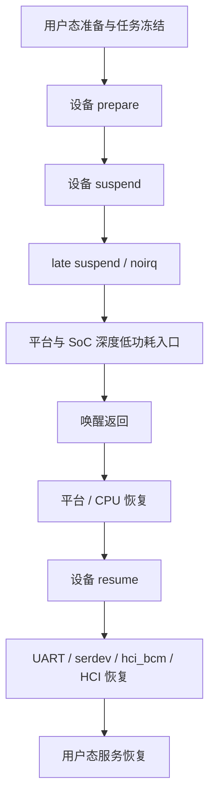
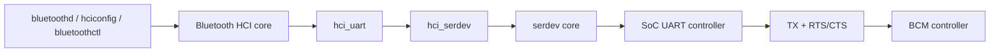

# 07. Linux BCM 蓝牙 Deep Suspend/Resume 故障排查：从现象到最小可疑范围

> 本文记录一次 Linux 目标板上 Broadcom BCM 蓝牙在真正 `deep` 休眠约 50 秒后唤醒异常的排查过程。
>
> 文章只报告当前证据能支持的范围，不把“可能性降低”写成“已经排除”，也不把“分层模型”误写成“已经知道具体哪一层坏了”。设备内网地址和本地绝对路径已脱敏；源码行号来自 Linux 6.12 目标树，换版本后应优先以函数名和调用关系为准。

## TL;DR

### 已经定位到哪里

```text
用户态 / BlueZ
        ↓ 已基本排除
HCI 基础运行路径
        ↓ 已基本排除
pm_test=core 覆盖的基础 PM 流程
        ↓ 已通过
真实 deep 低功耗返回后的链路
        ↓ 当前最小可疑范围
UART/serdev/硬件流控
    + BT_WAKE/HOST_WAKE
    + BCM 唤醒后的首条 HCI 命令响应
```

### 当前最强证据

- 正常启动后蓝牙工作正常，真正 `deep` 休眠约 50 秒后唤醒，首条 HCI 命令超时；
- `pm_test=core` 通过，但不能模拟真实 deep 的平台固件/低功耗入口；
- UART `power/control=auto` 和 `on` 都在 50 秒休眠 × 5 次中失败；
- VBAT、32 kHz、BT_REG_ON 正常，只能降低粗粒度掉电/复位的可能性；
- 将 `bcm_resume_device()` 的 15 ms 等待改为 1 秒后仍然失败；
- 停止 BlueZ 后，内核 HCI/serdev 路径仍可复现。

### 仍然没有定位到哪一个具体点

当前还不能仅凭日志判断是下面哪一项：

1. 首条 HCI 命令没有从 UART 发出；
2. 命令发出，但 BCM 没有被唤醒或没有响应；
3. BCM 已响应，但 UART RX、HOST_WAKE、IRQ、serdev 或 H4 parser 没有把响应交给 HCI。

这三个分支，才是下一步真正要区分的对象。

## 1. 先定义问题：什么算一次有效失败

### 1.1 现象

目标板正常启动后，蓝牙可以工作。进入真正的 `deep`，保持约 50 秒，再唤醒，典型失败链路是：

```text
系统本身恢复
    ↓
蓝牙内核设备仍可见
    ↓
BCM 唤醒后的首条 HCI 命令没有完成
    ↓
HCI command timeout，例如 -110
    ↓
出现 hardware error 0x00
    ↓
hci0 不能恢复为 UP RUNNING
```

因此“蓝牙异常”不能只看 `bluetoothd` 是否运行。每次测试至少要检查：

- 休眠前 `hci0` 是 `UP RUNNING`；
- 唤醒后 `hci0` 是否仍为 `UP RUNNING`；
- 是否出现首条 HCI command timeout；
- 是否出现 hardware error；
- 必要时是否能完成最小 HCI 查询。

### 1.2 最小复现环境

当前问题不需要扫描、配对、音频连接或具体蓝牙业务。最小环境是：

```text
Linux system PM
  + UART/serdev
  + hci_uart/hci_bcm
  + BCM 控制器
  + 真实 deep 休眠/唤醒
  + 唤醒后的 HCI 状态检查
```

`bluetoothd`、BlueZ 管理接口和业务应用可以描述用户态表现，但不是当前故障的必要前置条件。

## 2. 证据链：每个实验到底排除了什么

下面先按“观察 → 允许的结论 → 尚不能推出什么”推理，不先讲假设。

| 观察/实验 | 允许的结论 | 仍不能推出 |
|---|---|---|
| 正常启动后蓝牙可用 | 初始枚举、固件加载和普通运行路径基本可用 | deep resume 路径正常 |
| 停止 BlueZ 后仍可复现 | 用户态业务不是必要条件 | 所有用户态问题都不存在 |
| `pm_test=core` 通过 | 基础 PM 回调和浅层恢复没有直接卡死 | 真实 deep 的平台、retention、UART 硬件状态正常 |
| `power/control=auto`，50 秒 × 5 均失败 | 不是单纯 runtime PM auto 策略造成 | system PM 不影响 UART |
| `power/control=on`，50 秒 × 5 均失败 | 强制 runtime active 仍不能解决 | UART 在 deep 中保持全功耗、寄存器/FIFO 保持 |
| VBAT/32 kHz/BT_REG_ON 正常 | 粗粒度主电源、低频时钟和 BT_REG_ON 未见消失 | UART 独立时钟/电源域、IO retention、数据线正常 |
| 15 ms 改成 1 秒，50 秒 × 5 仍失败 | 单纯延长固定等待不是解决方案 | 恢复顺序、流控和 BCM 内部状态正常 |
| 首条 HCI 命令超时 | 故障发生在唤醒后的控制器通信闭环 | TX、BCM 响应、RX 三者中的具体断点 |

### 2.1 `power/control=auto` 与 `on` 的含义

```text
power/control=auto
    = 允许 runtime PM 根据空闲状态挂起/恢复

power/control=on
    = 禁止该设备进入 runtime suspend，保持 runtime active
```

这两个值只控制 runtime PM 策略。它们不等于系统 suspend 时 UART 一定保持全功耗，因为 `echo mem > /sys/power/state` 仍会执行 system PM 的 suspend/resume，平台也仍可能切换时钟、电源域和 IO retention。

所以 `auto`、`on` 都失败，只能排除“单纯 runtime autosuspend 策略”这一解释，不能排除 UART 关联驱动。

### 2.2 为什么 `pm_test=core` 通过仍不能排除驱动

Linux 的 `pm_test` 是分阶段调试工具。对于 suspend-to-RAM，`core` 可以测试核心的设备、处理器和系统设备路径，但**不等价于真正调用平台固件进入 sleep state**。参见 Linux 的 [suspend 调试文档](https://www.kernel.org/doc/html/latest/power/basic-pm-debugging.html) 和 [系统 suspend code flow](https://cdn.kernel.org/doc/html/latest/admin-guide/pm/suspend-flows.html)。

因此：

```text
pm_test=core 通过
    = 基础 PM 回调和浅层恢复可运行

真实 deep 失败
    = 真实平台/SoC 低功耗动作或硬件保持状态仍有问题可能
```

驱动仍可能在真实 deep 后出问题，例如：

- UART 驱动在真实硬件状态变化后恢复不完整；
- UART 父设备与 serdev/hci_bcm 恢复顺序不对；
- 回调返回成功，但 GPIO、时钟、FIFO 或 pinmux 实际状态错误；
- 只有真实 deep 才会触发 BCM 与主机之间的唤醒状态不一致。

### 2.3 实验纪律不是定位层级，但决定数据是否有效

有效基线是：

| 项目 | 条件 |
|---|---|
| 低功耗模式 | 真正 `deep` |
| 休眠时间 | 约 50 秒 |
| 每批样本 | 5 次 |
| 每次起始状态 | `hci0` 为 `UP RUNNING` |
| 失败后 | 先完整恢复蓝牙，再开始下一次 |
| 成功判据 | 唤醒后 `hci0` 为 `UP RUNNING`，无 HCI timeout |

早期“连续 2 次 deep 通过”的结论已经撤回：两个样本不能证明稳定。

“20 秒休眠 10 次”批次也不能计算成功率，因为失败后只做了部分用户态启动动作，没有确认 `hci0` 恢复，也没有做完整驱动恢复，后续样本被前一次异常污染。

最初观察到约 18 秒即可触发异常，但这个时长没有形成稳定基线；后续统一采用 50 秒。

## 3. 休眠阶段和命令分类

### 3.1 system suspend 的逻辑阶段

Linux system suspend 应拆成：



设备通常会经过 prepare、suspend、late suspend、noirq 等 PM 阶段；真正的 `deep` 还会执行平台和 SoC 的低功耗动作。阶段定义可参考 [CPU and Device Power Management](https://www.kernel.org/doc/html/latest/driver-api/pm/index.html)。

### 3.2 命令按作用分类

**选择内存睡眠实现：**

```sh
cat /sys/power/mem_sleep
echo s2idle > /sys/power/mem_sleep
echo deep > /sys/power/mem_sleep
```

- `s2idle`：suspend-to-idle，通常不进入最深的平台电源状态；
- `deep`：平台定义的深度内存睡眠。

**触发 system suspend：**

```sh
echo mem > /sys/power/state
systemctl suspend
rtcwake -m mem -s 50
```

**触发 hibernation：**

```sh
echo disk > /sys/power/state
systemctl hibernate
```

hibernation 通过 `/sys/power/disk` 选择 `platform`、`shutdown`、`reboot` 等模式，与本案例的 `mem/deep` 不是同一条路径。

**PM 分阶段调试：**

```sh
echo freezer   > /sys/power/pm_test
echo devices   > /sys/power/pm_test
echo platform  > /sys/power/pm_test
echo processors > /sys/power/pm_test
echo core      > /sys/power/pm_test
echo none      > /sys/power/pm_test
```

在本案例中，`core` 已经通过。因此在同一内核、同一脚本、同一硬件条件下，继续把 `freezer/devices/platform/processors` 全部重复一遍，不会带来新的定位信息；除非测试条件发生变化，或需要验证某个新改动没有破坏基础 PM。

## 4. 完整链路：serdev、UART、HCI 的顺序

### 4.1 发送方向



### 4.2 接收方向

```text
BCM controller
      ↓
UART RX + CTS/RTS
      ↓
SoC UART controller
      ↓
serdev receive callback
      ↓
hci_serdev
      ↓
hci_uart H4 parser
      ↓
Bluetooth HCI core
      ↓
用户态
```

层次含义：

- `serdev`：串行设备总线框架；
- `hci_serdev`：把 HCI UART 客户端接到 serdev；
- `hci_uart`：H4 等 UART HCI 传输；
- `hci_bcm`：Broadcom 控制器协议和 PM 适配；
- SoC UART 驱动：时钟、FIFO、DMA、pinmux、硬件流控和物理引脚。

这张图完成的是**静态分层**。它告诉我们有哪些层，但不告诉我们这一次唤醒实际断在哪个事件上。

## 5. DTS 和信号事实

目标设备树的关键关系可以抽象为：

```dts
&uart9 {
        compatible = "brcm,bcm4345c5";
        device-wakeup-gpios = <...>; /* BT_WAKE */
        host-wakeup-gpios   = <...>; /* HOST_WAKE */
        shutdown-gpios      = <...>; /* BT_REG_ON */
        max-speed = <1500000>;
};
```

| 信号 | 方向 | 作用 |
|---|---|---|
| BT_WAKE / device-wakeup | 主机 → BCM | 请求 BCM 唤醒或保持活动 |
| HOST_WAKE / host-wakeup | BCM → 主机 | BCM 请求主机唤醒或表示有数据 |
| BT_REG_ON / shutdown | 主机 → BCM | 电源/复位使能路径 |
| TX/RX | 双向 | HCI H4 字节流 |
| RTS/CTS | 双向 | UART 硬件流控 |

DTS 只能说明连接关系和配置意图，不能单独证明：

- deep 期间电平保持；
- IO retention 正常；
- pinmux 恢复；
- UART 时钟/FIFO 正常；
- UART 线上有正确波形。

具体高低电平还必须以 GPIO polarity、UART 控制器定义和原理图为准。

## 6. suspend/resume 的代码链路

以下函数可对照公开的 [hci_bcm.c](https://github.com/torvalds/linux/blob/v6.12/drivers/bluetooth/hci_bcm.c)、[hci_ldisc.c](https://github.com/torvalds/linux/blob/v6.12/drivers/bluetooth/hci_ldisc.c)、[hci_serdev.c](https://github.com/torvalds/linux/blob/v6.12/drivers/bluetooth/hci_serdev.c)、[serdev/core.c](https://github.com/torvalds/linux/blob/v6.12/drivers/tty/serdev/core.c) 和 [hci.h](https://github.com/torvalds/linux/blob/v6.12/include/net/bluetooth/hci.h)。

### 6.1 suspend

```text
PM core
  → bcm_suspend()
      → bcm_suspend_device()
          → hci_uart_set_flow_control(hu, true)
          → 设置 is_suspended
          → set_device_wakeup(false)
          → msleep(15)
  → UART/平台继续进入 deep
```

关键事实：

- `bcm_suspend_device()` 没有返回状态；
- PM 回调返回成功不等于 BT_WAKE、RTS/CTS、UART FIFO 和控制器状态都正确；
- GPIO、flow-control 和物理波形需要单独观测。

### 6.2 resume

```text
平台/CPU 从 deep 返回
  → UART/serdev 父设备恢复
      → bcm_resume()
          → bcm_resume_device()
              → set_device_wakeup(true)
              → msleep(15)
              → hci_uart_set_flow_control(hu, false)
  → HCI core 发送首条命令
  → serdev write → UART TX
  → BCM 返回 HCI event
  → hci_serdev 接收 → hci_uart/H4 解析
```

目标树中把 resume 固定等待从 15 ms 改为 1 秒后，50 秒 deep × 5 仍然失败。因此当前不支持“只是等待时间太短”的解释。

### 6.3 BT_WAKE、HOST_WAKE、RTS/CTS 的逻辑时序

**进入 suspend：**

```text
停止新的 HCI TX，等待 UART 空闲
        ↓
设置 flow-control / RTS 到 suspend 安全状态
        ↓
BT_WAKE 进入非唤醒状态
        ↓
等待控制器过渡（代码为 15 ms）
        ↓
进入真实 deep
```

**从 deep 返回：**

```text
先恢复 UART 电源、时钟、reset、pinmux、FIFO
        ↓
BT_WAKE 请求 BCM 唤醒
        ↓
等待控制器稳定（代码为 15 ms）
        ↓
恢复 RTS/CTS 与 flow-control
        ↓
发送首条 HCI 命令
        ↓
BCM 返回 command complete 或 hardware event
```

HOST_WAKE 是 BCM 到主机的输入/中断方向，通常作为系统唤醒源配置；它不是由 `bcm_resume_device()` 像 BT_WAKE 那样直接拉动。

## 7. 当前最小范围内的三个动态分支

前面的分层已经完成，下一步不是再画一遍层次，而是判断首条 HCI 命令在哪个动态事件上断掉：

### A. 主机没有真正发出首条命令

可能原因：

- hci_bcm resume 与 UART parent resume 顺序不对；
- flow-control/RTS 尚未恢复；
- HCI core 没有继续提交命令；
- UART clock、FIFO 或 pinmux 尚未可用。

### B. 主机发出了命令，但 BCM 没有响应

可能原因：

- BT_WAKE 时序或电平不符合控制器要求；
- BCM 内部状态未从 deep 返回；
- BCM 没有收到完整 TX；
- RTS/CTS 阻止了通信；
- HOST_WAKE/控制器唤醒握手失败。

### C. BCM 响应了，但主机没有完成 HCI 事件

可能原因：

- RX 线或 CTS 流控异常；
- UART FIFO/DMA/IRQ 没恢复；
- HOST_WAKE IRQ 丢失或极性错误；
- serdev receive callback 没有收到数据；
- H4 parser 没组成完整 event。

当前日志只有“首条 HCI command timeout”，还不足以在 A/B/C 中选择一个。

## 8. 当前概率排序

| 优先级 | 假设 | 为什么排在这里 | 还缺什么证据 |
|---|---|---|---|
| 1 | UART/serdev 恢复与硬件流控 | 首条命令失败，auto/on 和固定延时都无效 | TX/RX/RTS/CTS、FIFO、时钟和恢复顺序 |
| 2 | deep 导致 UART/IO retention、pinmux、reset 或电源域变化 | 只在真实 deep 后失败，core 通过 | s2idle/deep 对照、寄存器、pinctrl/波形 |
| 3 | BCM 唤醒握手或内部状态 | 电源正常但首条命令无响应 | BT_WAKE/HOST_WAKE 和 BCM 响应证据 |
| 4 | HOST_WAKE IRQ 路径 | 它决定 BCM 到主机的唤醒通知 | 实际 IRQ、极性、边沿、wakeup 状态 |
| 5 | hci_bcm/serdev/UART 恢复顺序或错误反馈 | 跨层 callback 成功不代表硬件状态成功 | PM trace 和 callback 时间戳 |
| 6 | 板级 UART 物理信号 | 没有 UART 测试点，软件无法完全证明 | 逻辑分析仪/示波器 |
| 7 | BlueZ/用户态 | 已能在用户态之下复现 | 当前没有继续优先分析的理由 |

前 1～3 项可能是同一故障的不同侧面，并不是互斥选项。

## 9. 真正有价值的下一步，以及每一步的目的

### 9.1 一次受控的 `s2idle`/ `deep` A/B

**目的**：确认故障是否依赖真实 deep，而不是重新做一次分层。

使用同一恢复脚本、同一起始状态和相同样本数：

```text
s2idle × N
deep   × N
```

结果解释：

| 结果 | 意义 |
|---|---|
| s2idle 通过，deep 失败 | 强化真实平台低功耗、retention、UART 恢复或硬件握手方向 |
| s2idle 也失败 | 说明问题可能位于两者共用的 system PM/UART/serdev/hci_bcm 路径 |
| 两者都通过 | 需要重新检查休眠时长、唤醒源和复现契约 |

它是一次验证性 A/B，不是把已经完成的静态分层推倒重来。

### 9.2 建立首条 HCI 命令时间线

**目的**：在当前最小范围内选择 A、B、C 三个动态分支。这是当前最高价值的实验。

至少记录：

```text
t0: UART parent resume end
t1: BT_WAKE active
t2: 固定等待结束
t3: flow-control / RTS restored
t4: HCI command write called
t5: serdev write called
t6: UART TX accepted
t7: HOST_WAKE asserted / IRQ hit
t8: UART RX callback
t9: HCI event parsed
t10: command complete
```

判定方式：

| 缺失点 | 优先指向 |
|---|---|
| t4/t5 不存在 | HCI/hci_bcm 恢复顺序或状态机 |
| t5 有、t6 无 | serdev/UART 驱动、时钟、FIFO、流控 |
| t6 有、没有 t7/t8 | BCM 唤醒、TX 电气链路、RTS/CTS、HOST_WAKE |
| 有 RX 波形但没有 t8 | UART IRQ/FIFO/DMA/serdev |
| t8 有但 t9/t10 无 | H4 parser、HCI 状态机或事件匹配 |

### 9.3 软件无法证明时再测 UART 波形

**目的**：把“软件认为发送/接收”与“引脚上实际发生了什么”分开。

只在时间线仍无法区分时测：

- BT_WAKE；
- HOST_WAKE；
- TX；
- RX；
- RTS；
- CTS。

观察四个窗口：

1. suspend 前；
2. 进入 deep 前；
3. deep 返回后；
4. 首条 HCI 命令及其响应。

当前没有 UART 测试点，所以物理信号问题仍不能被排除；如果无法接入测量设备，就必须把它明确标记为“未验证”，不能凭软件日志下结论。

### 9.4 每次失败后恢复正常

**目的**：保证样本独立，不是定位某一层。

失败后如果 `hci0` 仍是 DOWN 或驱动状态已污染，下一次测试就不再是同一实验。正确规则是：

```text
失败
  → 记录本次结果
  → 完整解绑/重绑定或使用已验证恢复流程
  → 确认 hci0 UP RUNNING
  → 才开始下一次
```

## 10. 当前不需要重复做的事情

基于现有证据，下面几项不应再作为优先动作：

- 不需要重复跑一遍 `freezer/devices/platform/processors/core`，因为 `core` 已在相同条件下通过；
- 不需要继续把固定延时从 1 秒改成更大的数值，1 秒仍失败已经否定了“单纯等待不足”；
- 不需要优先重新分析 `bluetoothd/BlueZ`，故障已在内核 HCI/serdev 路径出现；
- 不需要仅凭 VBAT、32 kHz、BT_REG_ON 正常就结束硬件方向；
- 不需要把没有恢复动作的重复失败计入成功率。

## 11. 源码审计地图

| 目标 | 代码入口 |
|---|---|
| hci_uart 组件组成 | `drivers/bluetooth/Makefile` |
| Broadcom runtime autosuspend 默认延时 | `drivers/bluetooth/hci_bcm.c:48`，`BCM_AUTOSUSPEND_DELAY=5000` |
| BCM suspend | `hci_bcm.c:762` 附近，`bcm_suspend_device()` |
| BCM resume | `hci_bcm.c:792` 附近，`bcm_resume_device()` |
| system/runtime PM ops | `hci_bcm.c:1503` 附近 |
| flow-control 的 serdev/tty 分支 | `hci_ldisc.c:316` 附近 |
| serdev write/receive/register | `hci_serdev.c:249/274/303` 附近 |
| serdev open 与 runtime PM | `drivers/tty/serdev/core.c:149` 附近 |
| serdev flow-control | `drivers/tty/serdev/core.c:342` 附近 |
| HCI `0x0c01` 等命令定义 | `include/net/bluetooth/hci.h:1105` 附近 |
| PM 分阶段调试 | [basic-pm-debugging.rst](https://github.com/torvalds/linux/blob/v6.12/Documentation/power/basic-pm-debugging.rst) |

## 12. 最终结论

当前最准确的结论是：

```text
用户态和普通 HCI 运行路径基本排除
    ↓
pm_test=core 基础 PM 流程通过
    ↓
真正 deep 返回后出现异常
    ↓
粗粒度 VBAT/32 kHz/BT_REG_ON 未见异常
    ↓
BCM 唤醒后的首条 HCI 命令未完成
    ↓
当前最小可疑范围：
UART/serdev/硬件流控
+ BT_WAKE/HOST_WAKE
+ BCM 唤醒后的首条 HCI 响应
```

“静态分层”已经完成；下一步不是继续列更多层，而是用最少的动态观测回答一个问题：

> 首条 HCI 命令究竟断在主机 TX、BCM 响应，还是主机 RX/HCI 解析？

因此后续优先级应是：

1. 受控比较 `s2idle` 与 `deep`，确认 deep 依赖性；
2. 建立首条 HCI 命令的 TX/HOST_WAKE/RX/HCI event 时间线；
3. 只有软件证据不足时才测 UART 五/六根信号；
4. 每次失败后恢复正常，保证样本独立。

这比重复做已经完成的 PM 分层更接近真正的定位闭环。
