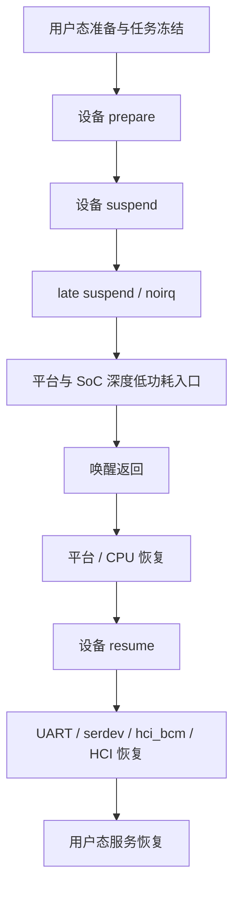
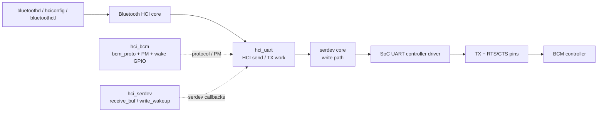
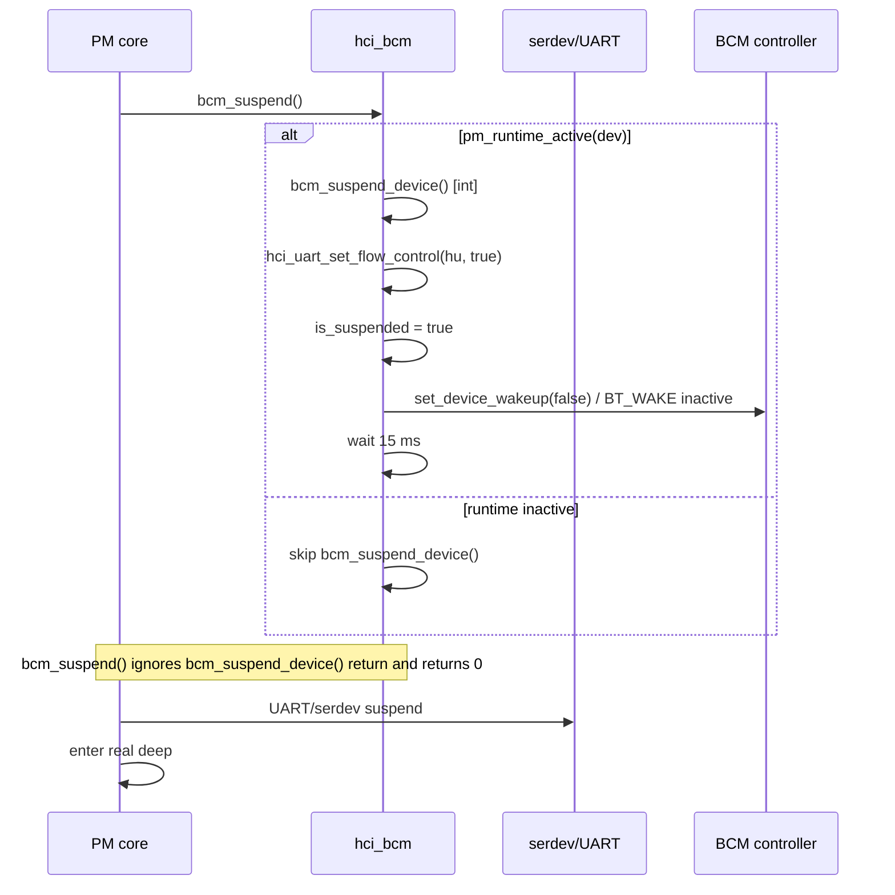

# 07. Linux BCM 蓝牙 Deep Suspend/Resume：从 serdev、UART、HCI 到 VCCIO3 IO Retention

> 一篇以证据为中心的内核/硬件协同排障记录：先固定复现契约，再画出跨层链路，最后用实验把范围压缩到最小可疑区间。
>
> 本文已经从范围定位推进到可逆 A/B 证实的根因边界，同时保留尚未用波形拆开的 pad 级机制。为适合公开发布，设备内网地址和本地绝对路径已脱敏；源码行号来自当时使用的 Linux 6.12 目标树，换版本后应优先以函数名和调用关系为准。

## TL;DR

**现象**：蓝牙正常工作时进入真正的 `deep`，休眠约 50 秒后唤醒，BCM 控制器唤醒后的首条 HCI 命令不完成，出现 `-110`/hardware error，`hci0` 不能回到 `UP RUNNING`。

**最终定位到的可修复根因边界**：

~~~text
真实 deep / LOGOFF
        ↓
未配置 UART9 所属 VCCIO3 IO domain 的 IO retention
        ↓
deep 期间 UART9 相关 pad 状态缺少保持保证
        ↓
唤醒后 BCM 的 UART HCI 通信失败
        ↓
首条 HCI command timeout
~~~

只在 DTS 增加下面这一项，其他内核、BCM 驱动、HCI 延时和测试流程不变：

~~~dts
&rockchip_suspend {
        rockchip,sleep-io-ret-config = <RKPM_VCCIO3_RET_EN>;
};
~~~

因果对照为：

| 配置 | 50 秒 deep 结果 |
|---|---:|
| 原始 DTS，无 `rockchip,sleep-io-ret-config` | 5/5 失败 |
| 只增加 `RKPM_VCCIO3_RET_EN` | 5/5 通过 |
| 恢复原始 DTS | 5/5 失败 |
| 再增加 retention，反向复测 | 1/1 通过 |

这已经足以把问题定位到“真实 deep 的 VCCIO3 IO-retention 配置缺失或不正确”这一软件/平台集成层。它还没有证明具体是 TX、RX、RTS、CTS 中哪一根线，或 mux、方向、pull、隔离、瞬态中的哪一个物理细节。

**完整链路必须这样理解**：

~~~text
用户态（可选入口）
    ↓
Bluetooth HCI core
    ↓
hci_uart / H4
    ↓
hci_serdev / serdev core
    ↓
UART9 / 8250-DW：时钟、FIFO、IRQ、DMA、RTS/CTS
    ↓
UART9 pads：TX、RX、RTS、CTS
    ↓
BCM HCI controller

系统 PM → UART/serdev/hci_bcm 的设备回调
         → Rockchip deep / BL31 / PMU
         → VCCIO3 IO retention
         → 平台返回与首条 HCI 命令
~~~

已经由实验排除或大幅降低的解释包括：BlueZ/bluetoothd 业务依赖、UART 节点 runtime PM `auto/on` 选择本身、单纯把 BCM resume 固定等待从 15 ms 延长到 1 秒、VBAT/32 kHz/BT_REG_ON 的粗粒度异常。这里的 `auto/on` 实验不等于排除了 `hci_bcm` 自身的 runtime-PM 回调，也不等于证明真实 deep 时 UART 的时钟、FIFO、pinmux 和 IO retention 一定保持。唤醒后软件可见的 UART 寄存器、FIFO、时钟和 pinmux 也没有显示稳定的永久损坏。

当前测试设备在实验结束后已恢复到原始配置；上面的 DTS 是已验证的修复方案，不表示现场仍保留临时实验镜像。

## 0. 阅读这篇文章需要先知道的事

本文把结论分成三类：

| 标签 | 含义 |
|---|---|
| **已观察** | 设备或日志直接显示的事实 |
| **可支持推断** | 多个事实共同支持，但还不是根因证明 |
| **未验证** | 仍需软件 trace、寄存器或示波器确认 |

这一区分很重要。比如“电源正常”是已观察事实；“电源不是问题”就超出了证据，因为 UART 的独立时钟、电源域、FIFO、IO retention 和 BCM 内部状态仍可能异常。

## 1. 事件定义：什么算失败

### 1.1 复现现象

目标板在正常启动后蓝牙可以工作。执行真正的 `deep` 休眠，保持约 50 秒，再唤醒，典型失败链路如下：

```text
系统本身恢复
    ↓
蓝牙内核设备仍然可见
    ↓
BCM 唤醒后的首条 HCI 命令没有完成
    ↓
HCI command timeout，例如 -110
    ↓
出现 hardware error 0x00
    ↓
hci0 不能恢复为 UP RUNNING
```

“蓝牙异常”不应只用 `bluetoothd` 是否退出判断。每次实验的成功判据应至少包括：

- `hci0` 在休眠前为 `UP RUNNING`；
- 唤醒后 `hci0` 仍为 `UP RUNNING`；
- 没有首条 HCI command timeout；
- 没有 hardware error；
- 必要时可完成一次最小 HCI 查询。

### 1.2 最小测试环境

复现不需要扫描、配对、音频连接或业务应用。最小环境只保留：

```text
Linux system PM
  + UART/serdev
  + hci_uart/hci_bcm
  + BCM 控制器
  + 真实 deep 休眠/唤醒
  + 唤醒后 HCI 状态检查
```

`bluetoothd`、BlueZ 管理接口和业务应用可以帮助描述用户体验，但不是当前故障链路的必要条件。

## 2. 复现契约：先把实验做成可比较的数据

近期工程故障复盘通常先定义影响、成功判据、基线和样本纪律，再讨论假设。本案例最终采用的有效基线是：

| 项目 | 固定条件 |
|---|---|
| 低功耗模式 | 真正的 `deep`，不能用 `pm_test` 代替 |
| 单次休眠时长 | 约 50 秒 |
| 每批样本 | 5 次 |
| 起始状态 | 每次确认 `hci0` 为 `UP RUNNING` |
| 失败处理 | 先完整恢复蓝牙，再开始下一次 |
| 成功判据 | 唤醒后 `hci0` 为 `UP RUNNING` 且无 HCI 超时 |
| 无效条件 | 上一次失败后没有完成恢复，或没有确认起始状态 |

最初曾观察到约 18 秒即可触发异常，但这个时长没有形成稳定基线。后续固定为 50 秒，以减少“休眠时间不足”和“样本状态不一致”带来的干扰。

早期“连续 2 次 deep 通过”的结论已经撤回：两次只能说明两个样本通过，不能称为稳定。

另一次“20 秒休眠 10 次”批次也不能计算成功率：脚本在失败后只重新执行了部分用户态启动动作，没有确认 `hci0` 回到 `UP RUNNING`，也没有为每次失败做完整驱动恢复，导致后续样本被前一次异常污染。

## 3. 证据矩阵：观察到什么，能推出什么

| 实验/观察 | 结果 | 可以支持的结论 | 不能推出的结论 |
|---|---|---|---|
| `pm_test=core` | 通过，蓝牙正常 | 基础 PM 回调链没有直接卡死 | 不能证明真实 deep 的平台/硬件保持状态正常 |
| UART 节点 `power/control=auto` | 50 秒 × 5，均失败 | 不是简单的 UART runtime autosuspend 策略问题 | 不能证明 `hci_bcm` runtime PM 或 system PM 没有影响 UART |
| UART 节点 `power/control=on` | 50 秒 × 5，均失败 | 强制 UART runtime active 仍不能解决 | 不能证明 `hci_bcm` runtime PM 或 deep 中的 UART 时钟/FIFO/pinmux 已保持 |
| VBAT / 32 kHz / BT_REG_ON | 正常 | 粗粒度电源、低频时钟、BT_REG_ON 复位路径未见消失 | 不能证明 UART 独立域和 IO retention 正常 |
| resume 延时 15 ms → 1 秒 | 50 秒 × 5，仍失败 | 单纯增大固定等待不是解决方案 | 不能排除恢复顺序或握手状态问题 |
| 停止 BlueZ | 内核 HCI/serdev 路径仍可复现 | 用户态业务不是必要条件 | 不能证明所有用户态问题都不存在 |
| 正常启动后蓝牙可用 | 通过 | 初始枚举和普通运行路径基本可用 | 不能证明 deep resume 路径可用 |

### 3.1 `auto` 和 `on` 到底表示什么

```text
power/control=auto
    = 允许 runtime PM 根据空闲状态自动挂起/恢复

power/control=on
    = 禁止该设备进入 runtime suspend，保持 runtime active
```

这两个值只描述 runtime PM 策略，不等于系统 suspend 时 UART 一定保持全功耗。执行 `echo mem > /sys/power/state` 时，system PM 仍会执行自己的 suspend/resume 回调，平台也仍可能切换时钟、电源域和 IO retention。

因此“UART 的 `power/control=on` 仍失败”不能推出“关联驱动已排除”；它只能降低“UART 节点的 runtime autosuspend 策略单独导致失败”的可能性，不能覆盖 `hci_bcm` 自身的 runtime PM 回调，也不能覆盖 system PM 和真实 deep 的硬件状态。

### 3.2 为什么 `pm_test=core` 不能排除关联驱动

Linux 内核文档把 `pm_test` 定义为分阶段测试工具。对于 suspend-to-RAM，`core` 可以测试核心设备/处理器/系统设备路径，但**不等于真正调用平台固件进入 sleep state**。可参见 [Linux suspend 调试文档](https://www.kernel.org/doc/html/latest/power/basic-pm-debugging.html) 和 [系统 suspend code flow](https://cdn.kernel.org/doc/html/latest/admin-guide/pm/suspend-flows.html)。

所以 `pm_test=core` 通过只说明：

- 基础设备回调没有立即挂死；
- 浅层 suspend/resume 时 UART/serdev/HCI 可以工作；
- 失败依赖真实 deep 或真实硬件状态的可能性上升。

它不能排除：

- 驱动在真实硬件低功耗状态下保存/恢复不完整；
- UART 父设备与 hci_bcm 的恢复顺序问题；
- 驱动回调成功返回，但 GPIO/时钟/FIFO 实际状态错误；
- 驱动只在真实 deep 后收到一个不同的硬件状态。

### 3.3 最新的单变量 A/B：只改变 VCCIO3 IO retention

前面的实验把问题收敛到了真实 deep 与 UART/IO 保持相关范围，但还没有把“相关”变成“因果”。决定性实验只改 DTS 的一个属性：

~~~dts
&rockchip_suspend {
        rockchip,sleep-io-ret-config = <RKPM_VCCIO3_RET_EN>;
};
~~~

内核、BL31/resource image、UART/BCM 驱动、用户态和测试脚本保持不变；每次失败后先完整恢复，再开始下一次样本。

| 配置 | 50 秒 deep 结果 |
|---|---:|
| 原始 DTS，无 `rockchip,sleep-io-ret-config` | 5/5 失败 |
| 只增加 `RKPM_VCCIO3_RET_EN` | 5/5 通过 |
| 恢复原始 DTS | 5/5 失败 |
| 再增加 retention 的反向复测 | 1/1 通过 |

因果关系是可逆的：

~~~text
无 retention → 失败
加 retention → 通过
去 retention → 失败
再加 retention → 通过
~~~

因此，本文不再把 UART 恢复、BCM 握手、HOST_WAKE 和物理波形作为并列的“尚未定位根因”。它们仍是 IO retention 影响 UART HCI 的机制级细化项；要证明当前软件修复成立，不需要先把它们拆到某一根线。

### 3.4 证据强度和结论边界

这组 A/B 证明的是：

- 真实 deep 路径是否启用 VCCIO3 IO retention，会决定本案例的 50 秒唤醒结果；
- 该配置是必要的修复控制点，且在当前测试条件下足以恢复 HCI 通信；
- 失败发生在 Linux 基础 PM 通过之后、真实 deep 相关的 IO 状态保持层。

这组 A/B 没有单独证明：

- 哪一个 UART pad 在 deep 窗口中发生了什么瞬态；
- retention 保存了输出值、方向、pull、keeper、mux 还是隔离状态中的哪几项；
- BL31/PMU 最终使用的具体物理寄存器字段；
- BCM 内部 HCI 状态机收到的最后一个字节或电平。

这些属于“根因机制的进一步展开”，不能反过来否定已经成立的配置级根因。

## 4. Linux 休眠的阶段与命令分类

### 4.1 系统 suspend 的阶段

Linux system suspend 至少应按下面的边界理解：



设备 PM 通常会经过 prepare、suspend、late suspend、noirq 等阶段；真正的 `deep` 还会触发平台和 SoC 的低功耗动作。相关阶段定义可参考 Linux 的 [CPU and Device Power Management](https://www.kernel.org/doc/html/latest/driver-api/pm/index.html)。

### 4.2 命令按作用分类

**选择内存睡眠实现：**

```sh
cat /sys/power/mem_sleep
echo s2idle > /sys/power/mem_sleep
echo deep > /sys/power/mem_sleep
grep '\[deep\]' /sys/power/mem_sleep
```

- `s2idle`：suspend-to-idle，通常不进入最深的平台电源状态；
- `deep`：平台定义的深度内存睡眠，通常更接近 suspend-to-RAM。

**触发 system suspend：**

```sh
echo mem > /sys/power/state
systemctl suspend
rtcwake -m mem -s 50
```

`rtcwake -m mem` 只表示选择 `mem` system-sleep state；实际采用哪个 suspend variant 取决于当前 `/sys/power/mem_sleep`。因此，脚本必须在每轮前确认输出中包含 `[deep]`，否则不能仅凭 `rtcwake -m mem` 声称测试的是 deep。它们的唤醒来源和控制方式也可能不同。

**触发 hibernation：**

```sh
echo disk > /sys/power/state
systemctl hibernate
```

hibernation 通过 `/sys/power/disk` 选择 `platform`、`shutdown`、`reboot` 等模式，和本案例的 `mem/deep` 不是同一条测试路径。

**只测试 PM 子阶段：**

```sh
echo freezer   > /sys/power/pm_test
echo devices   > /sys/power/pm_test
echo platform  > /sys/power/pm_test
echo processors > /sys/power/pm_test
echo core      > /sys/power/pm_test
echo none      > /sys/power/pm_test
```

`pm_test` 是调试开关，不应被当作真正的 deep 休眠替代品。每次实验完成后都要恢复 `none`。

## 5. 完整链路：serdev、UART、HCI 谁在谁的上面

### 5.1 发送方向

下面是逻辑数据路径，不是每个方框都对应独立的内核模块，也不是严格串行的调用栈。当前 DT BCM 路径由 `hci_bcm` 注册 `bcm_proto`；`hci_serdev` 主要提供 serdev client 回调，发送工作则由 `hci_uart` 的公共 TX 路径驱动。



### 5.2 接收方向

```text
BCM controller
      ↓
UART RX + CTS/RTS
      ↓
SoC UART controller
      ↓
serdev receive callback
      ↓
`hci_serdev.c:hci_uart_receive_buf()`
      ↓
`hu->proto->recv()`
      ↓
`hci_bcm.c:bcm_recv()`
      ↓
`h4_recv_buf()` / HCI frame reassembly
      ↓
Bluetooth HCI core
      ↓
用户态
```

几个层次不要混为一谈：

- `serdev` 是串行设备总线框架，不是 HCI 协议；
- `hci_serdev` 把 HCI UART 的 serdev client 回调接到 `hci_uart`；
- `hci_uart` 提供 HCI UART 的公共注册、发送 work 和 serdev/tty 适配；
- 当前 BCM 路径由 `hci_bcm` 的 `bcm_proto` 负责 Broadcom 控制器协议、PM、唤醒 GPIO，以及 `bcm_recv()` 中的 H4 帧重组；
- `hci_h4.c` 仍提供通用 H4 protocol，但当前 BCM DT 路径不是把通用 `h4p` 作为 `hu->proto`，而是由 `bcm_proto` 调用 `h4_recv_buf()`；
- SoC UART 驱动负责时钟、FIFO、DMA、pinmux、硬件流控和真实引脚。

“蓝牙驱动节点还在”不能证明 UART 能收发；“UART resume 回调返回 0”也不能证明 BCM 已经能处理首条 HCI 命令。

### 5.3 模块职责图：谁承载什么状态

`hci_bcm` 不是用户态服务，也不是 UART 控制器本身。它同时参与 BCM 控制器的 serdev 绑定、`bcm_proto` 注册、BT_WAKE/HOST_WAKE 管理以及系统/runtime PM 适配；`hci_uart` 提供公共 HCI-UART 注册和 TX work，`hci_serdev` 提供 serdev client 回调，当前 BCM 路径的 H4 帧重组由 `bcm_recv()` 调用 `h4_recv_buf()` 完成；UART 驱动才直接负责 FIFO、时钟、IRQ、DMA、termios 和硬件流控。

~~~mermaid
flowchart LR
    APP[用户态测试或蓝牙服务<br/>可选入口] --> CORE[Bluetooth HCI core]
    CORE --> HU[hci_uart<br/>common HCI-UART TX/RX]
    HU --> SC[serdev core]
    SC --> UART[UART9 / 8250-DW]
    UART --> PAD[TX RX RTS CTS pads]
    PAD <--> BCM[BCM HCI controller]
    HS[hci_serdev<br/>serdev client callbacks] -. callbacks .-> HU
    HB[hci_bcm<br/>bcm_proto + PM + wake GPIO] -. protocol / PM .-> HU
    HB -. callbacks .-> HS
    PM[system PM] --> RK[rockchip_pm_config]
    RK --> SMC[SUSPEND_IO_RET_CONFIG]
    SMC --> FW[BL31 / PMU]
    FW -. deep / IO retention .-> PAD
~~~

数据真正经过的是字节路径，唤醒 GPIO 和 PM 是并行的控制路径：

~~~mermaid
sequenceDiagram
    participant T as 测试命令
    participant C as Bluetooth HCI core
    participant H as hci_uart common TX
    participant P as hci_bcm bcm_proto
    participant S as serdev
    participant U as UART9
    participant B as BCM controller
    T->>C: 生成首条 HCI command
    C->>H: hdev->send()
    H->>P: hci_uart_send_frame() / bcm_enqueue()
    P->>S: H4 command frame queued
    S->>U: serdev write
    U->>B: TX bytes
    B-->>U: HCI event / command complete
    U-->>S: RX FIFO + receive callback
    S-->>H: hci_uart_receive_buf()
    H-->>P: proto->recv() / bcm_recv()
    P-->>C: h4_recv_buf() / hci_recv_frame()
    C-->>T: HCI command complete
~~~

所以“命令超时”并不是一个单点错误码。它可能代表 TX 没有被接受、字节没有出 UART、BCM 没收到、BCM 没被唤醒、RX 没进 UART、serdev callback 没上送，或 `bcm_recv()`/`h4_recv_buf()` 没组成完整 event。

~~~mermaid
flowchart TD
    A[首条 HCI command] --> B{write / TX 请求是否到达 UART?}
    B -- 否 --> C[hci core / hci_uart / serdev / UART resume]
    B -- 是 --> D{BCM 是否收到并处理?}
    D -- 否 --> E[BT_WAKE / CTS / pad retention / BCM wake]
    D -- 是 --> F{主机是否收到完整 HCI event?}
    F -- 否 --> G[RX / IRQ / FIFO / HOST_WAKE / serdev callback]
    F -- 是 --> H[`bcm_recv()`/`h4_recv_buf()` + HCI core 完成命令]
~~~

这个分支图解释了为什么只看 `hci0` 最终状态，不能反推出失败位于 TX、控制器还是 RX。

## 6. DTS 事实与信号角色

目标设备树的关键连接关系可以抽象为：

```dts
&uart9 {
        compatible = "brcm,bcm4345c5";
        device-wakeup-gpios = <...>; /* BT_WAKE */
        host-wakeup-gpios   = <...>; /* HOST_WAKE */
        shutdown-gpios      = <...>; /* BT_REG_ON */
        max-speed = <1500000>;
};
```

| 信号 | 方向 | 角色 |
|---|---|---|
| BT_WAKE / device-wakeup | 主机 → BCM | 主机请求 BCM 唤醒或保持活动 |
| HOST_WAKE / host-wakeup | BCM → 主机 | BCM 请求主机唤醒或表示有数据 |
| BT_REG_ON / shutdown | 主机 → BCM | 电源/复位使能路径，通常不是每次普通 resume 都翻转 |
| TX/RX | 双向数据 | HCI H4 字节流 |
| RTS/CTS | 双向流控 | 防止发送方超过接收方处理能力 |

DTS 只能说明连接关系和配置意图。要证明 deep 期间信号正确，还需要结合 pinctrl、IO retention、UART 寄存器和实际波形。具体高低电平必须以 GPIO polarity、UART 控制器定义和原理图为准，不能从信号名直接猜。

### 6.1 当前板级连接和 UART9 pinctrl

目标树中的 BCM 子节点和 UART9 硬件流控配置是：

~~~dts
&uart9 {
        status = "okay";
        pinctrl-names = "default";
        pinctrl-0 = <&uart9m0_xfer &uart9m0_ctsn &uart9m0_rtsn>;
        uart-has-rtscts;

        bluetooth {
                compatible = "brcm,bcm4345c5";
                device-wakeup-gpios = <&gpio0 RK_PC5 GPIO_ACTIVE_HIGH>;
                host-wakeup-gpios = <&gpio0 RK_PA0 GPIO_ACTIVE_HIGH>;
                shutdown-gpios = <&gpio0 RK_PC6 GPIO_ACTIVE_HIGH>;
                max-speed = <1500000>;
        };
};
~~~

当前 M0 pinctrl 映射为：

| 信号 | SoC pad | 角色 |
|---|---|---|
| UART9 RX | GPIO2_C4 | BCM → AP 数据 |
| UART9 TX | GPIO2_C2 | AP → BCM 数据 |
| UART9 CTS | GPIO4_C5 | BCM → AP 流控输入 |
| UART9 RTS | GPIO4_C4 | AP → BCM 流控输出 |
| BT_WAKE | GPIO0_C5 | AP → BCM 唤醒请求 |
| HOST_WAKE | GPIO0_A0 | BCM → AP 唤醒请求/中断 |
| BT_REG_ON | GPIO0_C6 | AP → BCM 电源/复位使能 |

`uart9m0_xfer`、`uart9m0_ctsn` 和 `uart9m0_rtsn` 位于目标树的 VCCIO3 pinctrl 描述中。原理图中的 `VCCIO3_1V8` 是该 IO domain 的供电网络；“供电网络正常”与“deep 期间 pad 状态由 retention 保持”是两个不同命题。

### 6.2 retention 属性的代码链路

目标头文件定义：

~~~c
#define RKPM_VCCIO3_RET_EN BIT(3)
~~~

这里的 `BIT(3)` 是软件位掩码，即 `1 << 3`，值为 `0x8`；它不是寄存器偏移，也不是“VCCIO3 的第 3 个寄存器”。

DTS 增加的最小配置是：

~~~dts
&rockchip_suspend {
        rockchip,sleep-io-ret-config = <RKPM_VCCIO3_RET_EN>;
};
~~~

`rockchip_pm_config.c` 的链路可以画成：

~~~mermaid
flowchart TD
    DTS[rockchip,sleep-io-ret-config] --> L[Linux rockchip_pm_config<br/>probe / 初始化]
    L --> S[SUSPEND_IO_RET_CONFIG SMC]
    S --> F[BL31 / secure firmware / PMU]
    F --> R[VCCIO3 retention behavior<br/>具体字段由 firmware / TRM 定义]
    R --> P[UART9 TX RX RTS CTS pads]
    P <--> C[BCM controller]
    V[VCCIO3_1V8 rail] --> P
    REG[regulator-on-in-suspend] -. external rail policy .-> V
~~~

Linux 代码能证明属性在 `rockchip_pm_config` 初始化时被读取，并通过 `SUSPEND_IO_RET_CONFIG` SMC 下发；`pm_config_prepare()` 后续主要设置当前 sleep state、mode 和 wakeup 配置，并不会在每次 deep 入口重新下发该 IO-ret 参数。Linux 不能单独证明 BL31/PMU 最终使用的物理寄存器字段或具体 isolation 行为；那需要芯片 TRM、固件源码或硬件测量。

### 6.3 IO retention 不等于 VCCIO3 供电保持

必须把三件事分开：

| 控制项 | 代表什么 | 不能直接推出什么 |
|---|---|---|
| VCCIO3_1V8 | IO domain 的供电网络 | mux、方向、输出值、pull 和隔离状态一定保持 |
| regulator-on-in-suspend | 请求外部 regulator 在 suspend 保持开启 | SoC 内部 IO retention 已开启 |
| RKPM_VCCIO3_RET_EN | 请求 SoC/PMU 对 VCCIO3 IO domain 做 retention | 外部 1.8 V 一定保持开启 |

IO retention 是低功耗期间对 pad 状态、上下文或隔离行为的保持机制，具体覆盖哪些 bit 必须以 TRM/安全固件实现为准。因此：

~~~text
VCCIO3 供电保持
        ≠
VCCIO3 IO pad 状态保持
~~~

把 regulator 保持开启、UART runtime PM 设为 `on`，都不能替代 `RKPM_VCCIO3_RET_EN`。本案例中 `power/control=on` 仍然 5/5 失败，而只增加 retention 后 5/5 通过，正是这两个控制面的区分。

## 7. suspend/resume 的代码和时序

以下函数名来自目标 Linux 6.12 树；公开源码可对照 [hci_bcm.c](https://github.com/torvalds/linux/blob/v6.12/drivers/bluetooth/hci_bcm.c)、[hci_ldisc.c](https://github.com/torvalds/linux/blob/v6.12/drivers/bluetooth/hci_ldisc.c)、[hci_serdev.c](https://github.com/torvalds/linux/blob/v6.12/drivers/bluetooth/hci_serdev.c)、[serdev/core.c](https://github.com/torvalds/linux/blob/v6.12/drivers/tty/serdev/core.c) 和 [hci.h](https://github.com/torvalds/linux/blob/v6.12/include/net/bluetooth/hci.h)。

### 7.1 suspend



这里的图只表示这条设备链路的相对顺序：PM core 在 suspend 时会等待子设备完成后再处理 parent，resume 时会等待 parent 完成后再处理 child；无关设备仍可能异步执行。

目标树中的关键逻辑可以概括为：

```text
bcm_suspend()
  → if pm_runtime_active(dev)
      → bcm_suspend_device()  // int，返回值被 bcm_suspend() 忽略
          → hci_uart_set_flow_control(hu, true)
          → 设置 is_suspended
          → set_device_wakeup(false)
          → msleep(15)
  → UART/平台继续进入 deep
```

`bcm_suspend_device()` 本身是 `int` 函数：`set_device_wakeup(false)` 失败时返回 `-EBUSY`，成功时返回 `0`。但 `bcm_suspend()` 只有在 `pm_runtime_active(dev)` 时调用它，并且忽略其返回值，最终固定返回 `0`。因此 PM callback 返回成功，不能证明 BT_WAKE、RTS/CTS、UART、pad 或 BCM 实际状态已经正确。

### 7.1.1 一个容易误读的返回值细节

目标 Linux 6.12 树中，`bcm_suspend_device()` 的函数类型是 `int`，本身会返回 `0` 或错误码；但 system-sleep 包装函数 `bcm_suspend()` 没有接住并传播这个返回值，最后仍返回 `0`。`bcm_resume()` 也会保存 `bcm_resume_device()` 的错误，但最终仍返回 `0`；该错误只影响 runtime-PM 状态重新激活的分支。

~~~text
PM callback 返回 0
        ≠
BT_WAKE、UART、pad、FIFO、BCM 状态和唤醒后的 HCI event 已经被证明正确
~~~

所以这里能得出的准确结论是“包装回调没有把底层错误报告给 system PM”，而不是“底层函数没有返回状态”。

### 7.2 resume

```mermaid
sequenceDiagram
    participant PM as PM/平台
    participant SER as UART/serdev
    participant BCM as hci_bcm
    participant HCI as HCI core
    participant CHIP as BCM controller
    PM->>SER: UART parent/controller resume complete
    SER->>BCM: child PM dependency satisfied; hci_bcm resume
    BCM->>CHIP: BT_WAKE -> active
    BCM->>BCM: wait 15 ms
    BCM->>SER: restore flow-control / RTS
    HCI->>SER: first HCI command
    SER->>CHIP: UART TX
    CHIP-->>SER: HCI event / RX
    SER-->>HCI: parsed command complete
```

代码路径可简化为：

```text
平台/CPU 从 deep 返回
  → UART/serdev 父设备恢复
      → bcm_resume()
          → bcm_resume_device()
              → set_device_wakeup(true)
              → msleep(15)
              → hci_uart_set_flow_control(hu, false)
  → HCI core 发送首条命令
  → serdev write → UART TX
  → BCM 返回 HCI event
  → hci_serdev.c:hci_uart_receive_buf()
  → hu->proto->recv()
  → hci_bcm.c:bcm_recv()
  → h4_recv_buf() / HCI frame reassembly
```

把 `bcm_resume_device()` 的等待从 15 ms 改为 1 秒后，相同的 50 秒 deep × 5 仍然失败，日志仍出现 `hardware error 0x00` 和 HCI command timeout。因此目前不支持“只需要更长固定等待”的解释。

### 7.3 flow-control 的落点

在 serdev 路径中，`hci_uart_set_flow_control(hu, enable)` 实际把取反后的逻辑值传给 serdev：

```text
serdev_device_set_flow_control(hu->serdev, !enable)
serdev_device_set_rts(hu->serdev, !enable)
```

因此当前代码中，suspend 的 `enable=true` 表示向 serdev 传入 `false`，resume 的 `enable=false` 表示向 serdev 传入 `true`。这说的是软件逻辑参数，不等同于示波器上的高低电平；传统 tty 路径则可能操作 CRTSCTS 和 RTS。最终逻辑值、电气极性、pinctrl 状态和引脚方向要由 UART 控制器、serdev、DTS 和原理图共同确认。

### 7.4 HCI 超时的含义

唤醒后超时的命令可能是 `HCI_OP_SET_EVENT_MASK`（`0x0c01`）或其他恢复命令。HCI 层看到 `-ETIMEDOUT`，只表示规定时间内没有收到匹配的 command complete/event，无法单独区分：

```text
主机没有发出 TX
    或
UART 发出但 BCM 没收到
    或
BCM 没被 BT_WAKE 唤醒
    或
BCM 收到但没有返回
    或
BCM 返回但 RX/CTS/HOST_WAKE 丢失
    或
字节到达但 `bcm_recv()`/`h4_recv_buf()` 没组成完整 event
```

因此“首条 HCI 命令超时”必须继续拆成 TX 证据和 RX event 证据。

## 8. 三根唤醒/流控信号的预期时序

以下是逻辑顺序，不直接规定高低电平。

### 8.1 suspend 前

```text
停止新的 HCI TX，等待 UART 空闲
        ↓
设置 flow-control / RTS 到 suspend 安全状态
        ↓
BT_WAKE 进入非唤醒状态
        ↓
等待控制器完成过渡（代码为 15 ms）
        ↓
进入真实 deep
```

HOST_WAKE 是 BCM 到主机的输入/中断方向；在当前驱动中，只有成功取得 host-wakeup IRQ/GPIO 并完成 IRQ/wakeup 配置后，才会作为设备唤醒路径使用。它不是由 `bcm_resume_device()` 像 BT_WAKE 那样直接拉动。

### 8.2 resume 后

```text
UART parent/controller resume 完成；UART 驱动按自身 PM 路径恢复时钟、寄存器/FIFO 等，pinmux/reset 的具体先后需由 trace 确认
        ↓
BT_WAKE 请求 BCM 唤醒
        ↓
等待控制器稳定（代码为 15 ms）
        ↓
恢复 RTS/CTS 与 UART flow-control
        ↓
发送首条 HCI 命令
        ↓
BCM 返回 command complete 或 hardware event
```

如果 UART 在恢复 flow-control 前还没有可用时钟/FIFO，或者 BT_WAKE 已经有效但 BCM 内部状态未恢复，那么把 15 ms 改成 1 秒仍可能失败。

### 8.3 把逻辑时序和电平时序分开

在当前 DTS 中，`BT_WAKE` 和 `HOST_WAKE` 配置为 `GPIO_ACTIVE_HIGH`；但 RTS/CTS 的信号名带有 `n`，其物理有效极性和 UART 控制器的逻辑流控语义不能只靠名字猜。下面只画方向和事件，不把所有电平写成通用规则：

~~~mermaid
sequenceDiagram
    participant H as AP / UART9
    participant B as BCM
    Note over H,B: suspend 前：停止新 TX，等待发送路径收敛
    H->>H: 设置 RTS/CTS 安全状态
    H->>B: BT_WAKE 进入非唤醒状态
    B-->>H: HOST_WAKE 由 BCM 控制，通常保持 idle
    Note over H,B: 真实 deep：平台执行 IO retention / 低功耗
    H->>H: UART 驱动/平台按各自路径恢复时钟、pad 和 FIFO
    H->>B: BT_WAKE 请求 BCM 唤醒
    B-->>H: HOST_WAKE 仅在需要主机处理时有效
    H->>H: 恢复硬件流控
    H->>B: 首条 HCI command
    B-->>H: RX HCI event / command complete
~~~

这个时序的验证点分别属于不同层：

| 事件 | 主要证据 |
|---|---|
| BT_WAKE 请求 BCM | hci_bcm GPIO 日志或波形 |
| HOST_WAKE 唤醒主机 | GPIO IRQ、wakeup source 或波形 |
| RTS/CTS 放行 TX | UART 流控寄存器和波形 |
| 首条 command 发出 | hci_uart/serdev write、UART TX FIFO |
| event 返回 | UART RX、serdev callback、`bcm_recv()`/`h4_recv_buf()`、HCI completion |

本案例没有 UART 测试点，所以只能完成软件侧证据，不能把 TX/RX/RTS/CTS 的 deep 窗口波形写成已证实事实。

## 9. 当前排除边界与已定位根因

决定性 A/B 之后，候选项不再应该被当作互相独立的概率列表。可以区分为“已经排除/降低”“已经定位到的配置层”“仍待机制级细化”三类。

| 层次 | 当前判断 | 依据 |
|---|---|---|
| 蓝牙业务应用 | 基本排除 | 最小复现不需要扫描、配对、音频或业务 |
| bluetoothd / BlueZ | 基本排除 | 停止用户态服务后内核 HCI/serdev 仍可复现 |
| HCI 初始枚举/普通运行 | 部分排除 | 正常启动后可用，普通收发路径存在 |
| runtime PM `auto/on` 策略本身 | 基本排除 | 两种策略均为 50 秒 × 5 失败 |
| `pm_test=core` 覆盖的基础回调 | 降低可能性 | `pm_test=core` 通过，但不覆盖真实 deep 硬件状态 |
| VBAT / 32 kHz / BT_REG_ON 粗粒度异常 | 大幅降低 | 休眠期间静态检查正常 |
| 15 ms 固定等待不足 | 降低可能性 | 改为 1 秒后仍为 50 秒 × 5 失败 |
| 唤醒后 UART 永久卡死 | 降低可能性 | 寄存器、FIFO、时钟、pinmux 快照接近健康状态 |
| VCCIO3 IO retention 配置缺失 | **已定位的可修复根因边界** | 单变量、可逆 A/B：无 retention 失败，加 retention 通过 |
| UART/serdev/BCM 具体恢复细节 | 机制级待细化 | 可能是 retention 影响后的表现，不再是并列根因 |
| TX/RX/RTS/CTS 的具体 pad 波形 | 未验证 | 没有 UART 测试点，尚无硬件波形 |
| BL31/PMU 的具体寄存器字段 | 未验证 | Linux 只看到 SMC 配置接口 |
| BCM 内部 HCI 状态机的具体失步点 | 未验证 | 目前没有完整 TX/RX event 时间线 |

### 9.1 “根因”在这里定位到了哪一层

当前可以提交和复用的准确表述是：

> RK3588 真实 deep suspend 配置遗漏了 UART9 所属 VCCIO3 IO domain 的 IO retention；只补充 `RKPM_VCCIO3_RET_EN` 即可恢复 BCM 蓝牙唤醒后的 HCI 通信。

这不是把“相关性”写成根因，而是因为满足了三个条件：

1. **单变量**：只改变 retention 配置；
2. **可重复**：原始配置 5/5 失败，增加配置 5/5 通过；
3. **可逆**：去掉配置重新 5/5 失败，再加回 1/1 通过。

因此根因已定位到“平台电源管理配置/IO domain retention”层。还未定位到的是它在 pad 和 HCI 字节层面的具体表现。

### 9.2 仍然保留的机制级问题

以下问题只在需要提交芯片/板级机制说明、或需要验证修复覆盖范围时继续追：

- deep 期间具体是哪一个 UART9 pad 的状态发生变化；
- 是 mux、方向、输出值、pull/keeper、隔离还是瞬态；
- `hci_bcm` 的 BT_WAKE/RTS/CTS 与 UART resume 哪个事件先后不符合预期；
- BCM 是否返回了 event、event 是否到达 UART RX、`bcm_recv()`/`h4_recv_buf()` 是否完整接收；
- BL31/PMU 最终把 `RKPM_VCCIO3_RET_EN` 映射到哪些 retention/isolation 位。

这些不会改变当前最小软件修复的成立。

## 10. 修复后验证与机制级细化（可选）

决定性 A/B 已经完成了根因定位。下面的实验不再是“还没找到根因所以必须继续猜”，而是分成两种目的：

- **修复回归**：确认最终内核、DTB、BL31 和板卡组合仍然稳定；
- **机制级细化**：如果需要说明具体 pad、波形、恢复顺序或 BCM 内部状态，再继续沿链路定位。

### 10.1 修复回归：同一脚本比较 s2idle 与 deep

在加 retention 的最终镜像上，使用同一恢复脚本、同一休眠时长、独立样本分别做 `s2idle` 和 `deep`。它的目的不是重新证明 root cause，而是确认：

~~~text
修复没有改变普通运行路径
        ↓
s2idle 保持通过
        ↓
deep 在修复配置下也稳定通过
~~~

如果要复核对照，应另刷回原始 DTS 做 control，不要在同一批样本中动态改写配置。

~~~mermaid
flowchart TD
    A[固定恢复脚本与起始状态] --> B[s2idle × N]
    B --> C[deep + VCCIO3 retention × N]
    C --> D{结果是否一致且稳定?}
    D -- 是 --> E[完成修复回归]
    D -- 否 --> F[检查镜像、DTB、BL31、样本恢复和板卡版本]
~~~

### 10.2 `pm_test`：确认边界，而不是替代 deep

`pm_test=core` 通过的意义是基础 PM 回调链本身没有直接卡死；它不能替代真实 deep，也不能单独排除关联驱动。修复前后的分层可记录为：

~~~text
none / freezer / devices / platform / processors / core
    ↓
基础回调和浅层路径
    ↓
真实 deep / 平台低功耗 / IO retention
~~~

修复前的边界是“`pm_test=core` 通过、真实 deep 失败”；修复后的边界应变成“真实 deep 也通过”。如果修复后只有某个 `pm_test` 失败，才需要回到具体 PM callback。

### 10.3 机制级定位：给首条 HCI command 建立时间线

如果需要继续证明是哪一段受 retention 影响，按下面的锚点记录同一条首命令：

| 时间点 | 事件 | 用途 |
|---|---|---|
| t0 | UART parent resume end | 判断 UART 基础设施何时可用 |
| t1 | `hci_bcm` 拉起 BT_WAKE | 判断 BCM 唤醒请求 |
| t2 | 15 ms/实际等待结束 | 判断固定等待边界 |
| t3 | 恢复 flow-control/RTS | 判断 UART 放行 |
| t4 | HCI core 生成 command | 命令是否真正产生 |
| t5 | serdev write / TX FIFO 接受 | 主机软件是否交给 UART |
| t6 | HOST_WAKE 变化 | BCM 是否向主机发出唤醒/数据提示 |
| t7 | UART RX FIFO / receive callback | 主机是否收到字节 |
| t8 | `bcm_recv()`/`h4_recv_buf()` 得到完整 event | 协议帧是否完整 |
| t9 | HCI command complete | HCI 核心是否完成命令 |

对应的故障分叉是：

~~~mermaid
flowchart TD
    A[首条 HCI command] --> B{t5：TX 是否被 UART 接受?}
    B -- 否 --> C[UART/serdev/hci_bcm resume 顺序]
    B -- 是 --> D{t7：RX 是否收到字节?}
    D -- 否 --> E[BT_WAKE/CTS/pad/BCM 响应]
    D -- 是 --> F{t8：是否组成完整 HCI event?}
    F -- 否 --> G[RX FIFO/IRQ/serdev/`bcm_recv()`/`h4_recv_buf()`]
    F -- 是 --> H[t9：HCI completion]
~~~

### 10.4 硬件信号测量：只用于 pad/波形级细化

如果软件锚点仍不能区分机制，再直接测 UART 相关信号：

~~~text
BT_WAKE、HOST_WAKE、TX、RX、RTS、CTS
~~~

覆盖四个窗口：

1. 进入 suspend 前；
2. 真实 deep 入口前后；
3. 从 deep 返回后；
4. 首条 HCI command 及其 HCI event。

这一步的意义是把“IO retention 影响了 UART”继续拆成电平、方向、边沿、毛刺和流控关系；它不是当前修复成立的前置条件。当前板卡 UART 没有可用测试点，因此该问题保持为未验证项。

### 10.5 每次样本的纪律

无论是回归还是机制细化，每次失败都必须：

~~~text
记录失败
  → 完整恢复 UART / BCM / HCI
  → 确认 hci0 UP RUNNING
  → 才开始下一次样本
~~~

失败状态下继续 suspend 会把前一次异常带入后一次样本，不能作为独立成功率。

## 11. 机制级调试锚点（非当前修复前置条件）

### 11.1 PM trace

重点观察：

```text
power:suspend_resume
power:device_pm_callback_start
power:device_pm_callback_end
```

核心问题是确认下面的真实顺序：

```text
UART parent/controller resume 完成
  → serdev 子设备依赖满足
      → hci_bcm resume callback
          → 首条 HCI TX
```

如果 trace 观察到 hci_bcm resume 已结束但 UART parent 尚未恢复，或首条 HCI TX 早于 UART clock/pinmux/FIFO 恢复，说明设备依赖、异步 PM 或驱动恢复顺序需要进一步核对。

### 11.2 dynamic debug

只对相关文件启用日志：

- `hci_bcm.c`：suspend/resume、BT_WAKE、HOST_WAKE、延时；
- `hci_serdev.c`：write、receive buffer、serdev open；
- `hci_ldisc.c`：flow-control、RTS、serdev/tty 分支；
- SoC UART 驱动：clock、reset、FIFO、DMA、termios 和 system/runtime PM。

### 11.3 首条命令的时间戳

至少记录：

```text
t0: UART parent resume end
t1: BT_WAKE active
t2: fixed delay end
t3: flow-control / RTS restored
t4: HCI command write called
t5: UART TX accepted
t6: HOST_WAKE asserted
t7: UART RX callback
t8: HCI event parsed
t9: command complete
```

缺少其中任意一个点，下一轮实验仍可能停留在“看起来像超时”的层面。

## 12. 代码审计地图

| 目标 | 代码入口 |
|---|---|
| hci_uart 组件组成 | `drivers/bluetooth/Makefile` |
| Broadcom runtime autosuspend 默认延时 | `drivers/bluetooth/hci_bcm.c:48`，`BCM_AUTOSUSPEND_DELAY=5000` |
| BCM suspend | `hci_bcm.c:762` 附近，`bcm_suspend_device()` |
| BCM resume | `hci_bcm.c:792` 附近，`bcm_resume_device()` |
| system/runtime PM ops | `hci_bcm.c:1503` 附近 |
| flow-control 的 serdev/tty 分支 | `hci_ldisc.c:316` 附近 |
| serdev write/receive/register | `hci_serdev.c:249/274/303` 附近 |
| BCM protocol、receive 和 H4 重组 | `hci_bcm.c:694/1307` 附近 |
| serdev open 与 runtime PM | `drivers/tty/serdev/core.c:149` 附近 |
| serdev flow-control | `drivers/tty/serdev/core.c:342` 附近 |
| Rockchip retention 属性读取/SMC | `drivers/soc/rockchip/rockchip_pm_config.c:645` 附近 |
| `RKPM_VCCIO3_RET_EN` 定义 | `include/dt-bindings/suspend/rockchip-rk3588.h:61` 附近 |
| HCI `0x0c01` 等命令定义 | `include/net/bluetooth/hci.h:1105` 附近 |
| PM 分阶段调试 | [basic-pm-debugging.rst](https://github.com/torvalds/linux/blob/v6.12/Documentation/power/basic-pm-debugging.rst) |

## 13. 最终结论

这次问题的完整逻辑链是：

~~~mermaid
flowchart TD
    A[用户态与普通蓝牙运行] --> B[Linux PM prepare / device callbacks]
    B --> C[pm_test=core：通过]
    C --> D[真实 deep / LOGOFF]
    D --> E{VCCIO3 IO retention}
    E -- 未配置 --> F[UART9 所属 pad 缺少 deep 保持保证]
    F --> G[唤醒后首条 HCI 命令无完整响应]
    G --> H[hci0 异常]
    E -- RKPM_VCCIO3_RET_EN --> I[UART9 IO 状态得到 retention 配置]
    I --> J[BCM HCI event 返回]
    J --> K[hci0 恢复正常]
~~~

因此，当前最准确的结论不是“蓝牙服务没有恢复”，也不是“`pm_test=core` 通过所以驱动没问题”，而是：

> 在当前目标树、板卡和 BL31/resource image 组合中，Linux 休眠准备和基础 PM 流程正常；真实 deep suspend 配置遗漏了 UART9 所属 VCCIO3 IO domain 的 IO retention，导致唤醒后的 BCM UART HCI 通信失败。补上 `RKPM_VCCIO3_RET_EN` 后，在原始 DTS 5/5 失败与修复 5/5 通过的可逆对照中恢复正常。

已经定位到的是平台配置/IO domain retention 层；尚未定位到的是 TX、RX、RTS、CTS 具体哪一个 pad，以及 retention 影响的具体寄存器字段、瞬态波形或 BCM 内部失步点。后者是机制级细化，不影响当前最小软件修复成立。

本次实验结束后测试设备已恢复到原始运行状态；产品合入前仍需在最终固定的内核、DTB、BL31、模块和板卡版本上进行独立样本回归。
