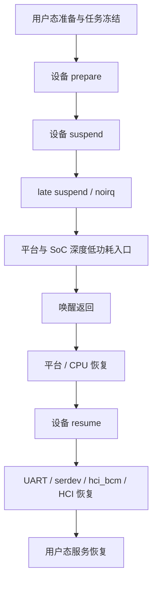
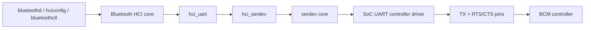
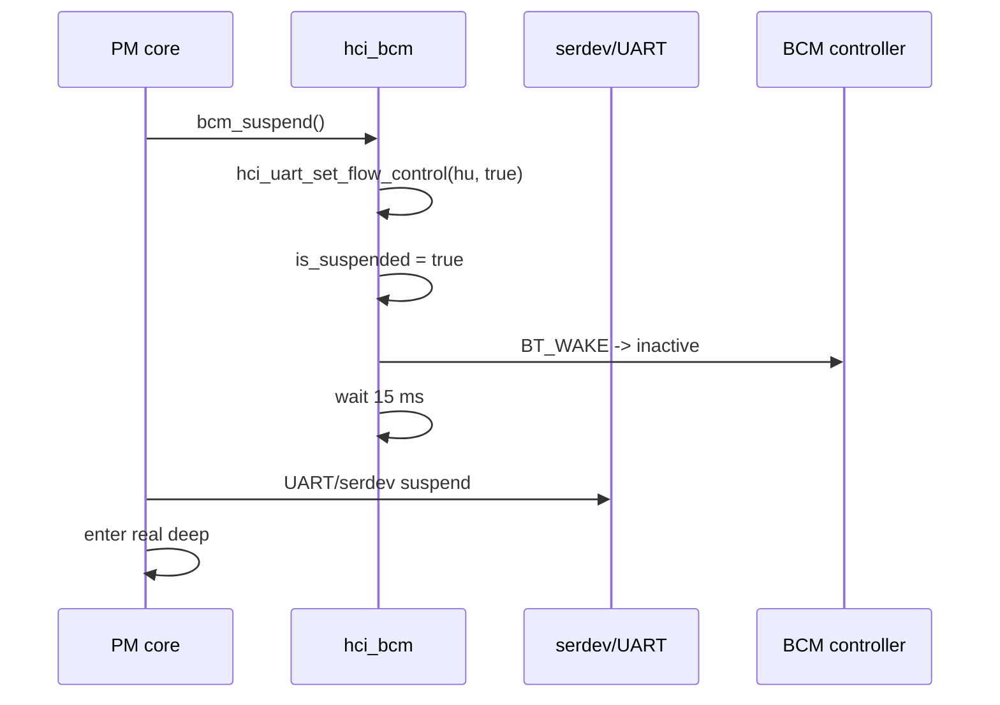
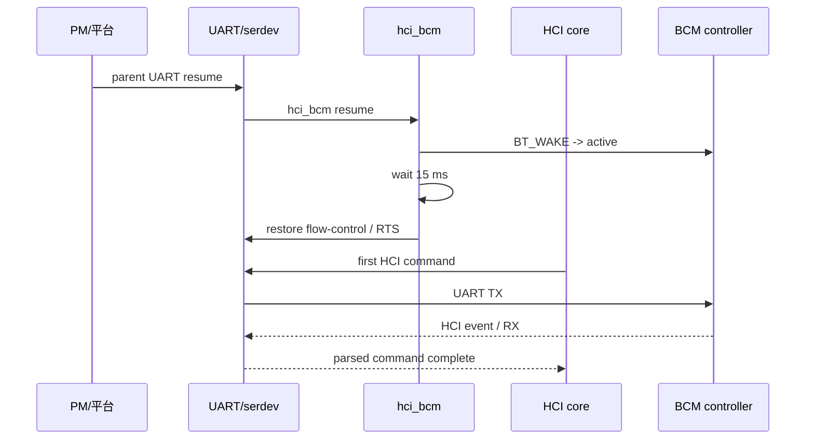
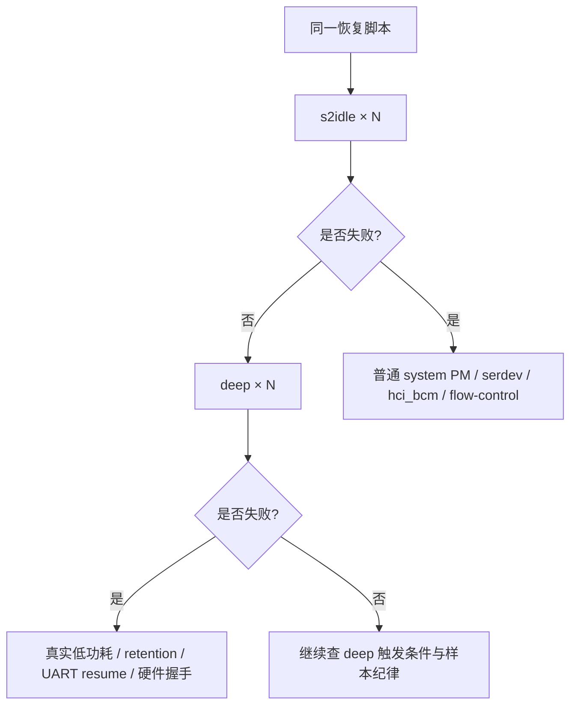

# 07. Linux BCM 蓝牙 Deep Suspend/Resume 故障排查：从 serdev、UART 到 HCI 首条命令超时

> 一篇以证据为中心的内核/硬件协同排障记录：先固定复现契约，再画出跨层链路，最后用实验把范围压缩到最小可疑区间。
>
> 本文是“范围定位”而不是“根因定案”。为适合公开发布，设备内网地址和本地绝对路径已脱敏；源码行号来自当时使用的 Linux 6.12 目标树，换版本后应优先以函数名和调用关系为准。

## TL;DR

**现象**：蓝牙正常工作时进入真正的 `deep`，休眠约 50 秒后唤醒，BCM 控制器唤醒后的首条 HCI 命令不完成，出现 `-110`/hardware error，`hci0` 不能回到 `UP RUNNING`。

**当前最小可疑范围**：

```text
真实 deep 低功耗入口/返回
        ↓
UART 控制器 / serdev 恢复、FIFO、时钟、RTS/CTS
        ↓
hci_bcm 唤醒时序与 HOST_WAKE
        ↓
BCM 返回唤醒后的首条 HCI 命令响应
```

**当前最重要的证据**：

- `pm_test=core` 通过，但真实 `deep` 仍失败；
- UART `power/control=auto` 和 `on` 两种策略下，50 秒休眠 × 5 次均失败；
- VBAT、32 kHz、BT_REG_ON 正常，只能排除粗粒度掉电/复位；
- `bcm_resume_device()` 的固定等待从 15 ms 改成 1 秒，50 秒休眠 × 5 次仍失败；
- 停止 BlueZ 后，内核 HCI/serdev 链路仍可复现。

**当前不能声称**：已经定位到某一个具体寄存器、某一根 UART 线或某一个硬件器件。下一刀应优先做 `s2idle` 与 `deep` 对比，并为首条 HCI 命令建立 TX/RX 时间线。

## 0. 阅读这篇文章需要先知道的事

本文把结论分成三类：

| 标签 | 含义 |
|---|---|
| **已观察** | 设备或日志直接显示的事实 |
| **可支持推断** | 多个事实共同支持，但还不是根因证明 |
| **未验证** | 仍需软件 trace、寄存器或示波器确认 |

这一区分很重要。比如“电源正常”是已观察事实；“电源不是问题”就超出了证据，因为 UART 的独立时钟、电源域、FIFO、IO retention 和 BCM 内部状态仍可能异常。

## 1. 事件定义：什么算失败

### 1.1 复现现象

目标板在正常启动后蓝牙可以工作。执行真正的 `deep` 休眠，保持约 50 秒，再唤醒，典型失败链路如下：

```text
系统本身恢复
    ↓
蓝牙内核设备仍然可见
    ↓
BCM 唤醒后的首条 HCI 命令没有完成
    ↓
HCI command timeout，例如 -110
    ↓
出现 hardware error 0x00
    ↓
hci0 不能恢复为 UP RUNNING
```

“蓝牙异常”不应只用 `bluetoothd` 是否退出判断。每次实验的成功判据应至少包括：

- `hci0` 在休眠前为 `UP RUNNING`；
- 唤醒后 `hci0` 仍为 `UP RUNNING`；
- 没有首条 HCI command timeout；
- 没有 hardware error；
- 必要时可完成一次最小 HCI 查询。

### 1.2 最小测试环境

复现不需要扫描、配对、音频连接或业务应用。最小环境只保留：

```text
Linux system PM
  + UART/serdev
  + hci_uart/hci_bcm
  + BCM 控制器
  + 真实 deep 休眠/唤醒
  + 唤醒后 HCI 状态检查
```

`bluetoothd`、BlueZ 管理接口和业务应用可以帮助描述用户体验，但不是当前故障链路的必要条件。

## 2. 复现契约：先把实验做成可比较的数据

近期工程故障复盘通常先定义影响、成功判据、基线和样本纪律，再讨论假设。本案例最终采用的有效基线是：

| 项目 | 固定条件 |
|---|---|
| 低功耗模式 | 真正的 `deep`，不能用 `pm_test` 代替 |
| 单次休眠时长 | 约 50 秒 |
| 每批样本 | 5 次 |
| 起始状态 | 每次确认 `hci0` 为 `UP RUNNING` |
| 失败处理 | 先完整恢复蓝牙，再开始下一次 |
| 成功判据 | 唤醒后 `hci0` 为 `UP RUNNING` 且无 HCI 超时 |
| 无效条件 | 上一次失败后没有完成恢复，或没有确认起始状态 |

最初曾观察到约 18 秒即可触发异常，但这个时长没有形成稳定基线。后续固定为 50 秒，以减少“休眠时间不足”和“样本状态不一致”带来的干扰。

早期“连续 2 次 deep 通过”的结论已经撤回：两次只能说明两个样本通过，不能称为稳定。

另一次“20 秒休眠 10 次”批次也不能计算成功率：脚本在失败后只重新执行了部分用户态启动动作，没有确认 `hci0` 回到 `UP RUNNING`，也没有为每次失败做完整驱动恢复，导致后续样本被前一次异常污染。

## 3. 证据矩阵：观察到什么，能推出什么

| 实验/观察 | 结果 | 可以支持的结论 | 不能推出的结论 |
|---|---|---|---|
| `pm_test=core` | 通过，蓝牙正常 | 基础 PM 回调链没有直接卡死 | 不能证明真实 deep 的平台/硬件保持状态正常 |
| UART `power/control=auto` | 50 秒 × 5，均失败 | 不是简单的 runtime PM auto 策略问题 | 不能证明 system PM 没有影响 UART |
| UART `power/control=on` | 50 秒 × 5，均失败 | 强制 runtime active 仍不能解决 | 不能证明 UART 时钟/FIFO/pinmux 在 deep 中保持 |
| VBAT / 32 kHz / BT_REG_ON | 正常 | 粗粒度电源、低频时钟、BT_REG_ON 复位路径未见消失 | 不能证明 UART 独立域和 IO retention 正常 |
| resume 延时 15 ms → 1 秒 | 50 秒 × 5，仍失败 | 单纯增大固定等待不是解决方案 | 不能排除恢复顺序或握手状态问题 |
| 停止 BlueZ | 内核 HCI/serdev 路径仍可复现 | 用户态业务不是必要条件 | 不能证明所有用户态问题都不存在 |
| 正常启动后蓝牙可用 | 通过 | 初始枚举和普通运行路径基本可用 | 不能证明 deep resume 路径可用 |

### 3.1 `auto` 和 `on` 到底表示什么

```text
power/control=auto
    = 允许 runtime PM 根据空闲状态自动挂起/恢复

power/control=on
    = 禁止该设备进入 runtime suspend，保持 runtime active
```

这两个值只描述 runtime PM 策略，不等于系统 suspend 时 UART 一定保持全功耗。执行 `echo mem > /sys/power/state` 时，system PM 仍会执行自己的 suspend/resume 回调，平台也仍可能切换时钟、电源域和 IO retention。

因此“`power/control=on` 仍失败”不能推出“驱动已排除”；它只能排除“单纯 runtime autosuspend 策略导致失败”。

### 3.2 为什么 `pm_test=core` 不能排除关联驱动

Linux 内核文档把 `pm_test` 定义为分阶段测试工具。对于 suspend-to-RAM，`core` 可以测试核心设备/处理器/系统设备路径，但**不等于真正调用平台固件进入 sleep state**。可参见 [Linux suspend 调试文档](https://www.kernel.org/doc/html/latest/power/basic-pm-debugging.html) 和 [系统 suspend code flow](https://cdn.kernel.org/doc/html/latest/admin-guide/pm/suspend-flows.html)。

所以 `pm_test=core` 通过只说明：

- 基础设备回调没有立即挂死；
- 浅层 suspend/resume 时 UART/serdev/HCI 可以工作；
- 失败依赖真实 deep 或真实硬件状态的可能性上升。

它不能排除：

- 驱动在真实硬件低功耗状态下保存/恢复不完整；
- UART 父设备与 hci_bcm 的恢复顺序问题；
- 驱动回调成功返回，但 GPIO/时钟/FIFO 实际状态错误；
- 驱动只在真实 deep 后收到一个不同的硬件状态。

## 4. Linux 休眠的阶段与命令分类

### 4.1 系统 suspend 的阶段

Linux system suspend 至少应按下面的边界理解：



设备 PM 通常会经过 prepare、suspend、late suspend、noirq 等阶段；真正的 `deep` 还会触发平台和 SoC 的低功耗动作。相关阶段定义可参考 Linux 的 [CPU and Device Power Management](https://www.kernel.org/doc/html/latest/driver-api/pm/index.html)。

### 4.2 命令按作用分类

**选择内存睡眠实现：**

```sh
cat /sys/power/mem_sleep
echo s2idle > /sys/power/mem_sleep
echo deep > /sys/power/mem_sleep
```

- `s2idle)：suspend-to-idle，通常不进入最深的平台电源状态；
- `deep`：平台定义的深度内存睡眠，通常更接近 suspend-to-RAM。

**触发 system suspend：**

```sh
echo mem > /sys/power/state
systemctl suspend
rtcwake -m mem -s 50
```

它们可能进入同一类 system suspend，但唤醒来源和控制方式不同。

**触发 hibernation：**

```sh
echo disk > /sys/power/state
systemctl hibernate
```

hibernation 通过 `/sys/power/disk` 选择 `platform`、`shutdown`、`reboot` 等模式，和本案例的 `mem/deep` 不是同一条测试路径。

**只测试 PM 子阶段：**

```sh
echo freezer   > /sys/power/pm_test
echo devices   > /sys/power/pm_test
echo platform  > /sys/power/pm_test
echo processors > /sys/power/pm_test
echo core      > /sys/power/pm_test
echo none      > /sys/power/pm_test
```

`pm_test` 是调试开关，不应被当作真正的 deep 休眠替代品。每次实验完成后都要恢复 `none`。

## 5. 完整链路：serdev、UART、HCI 谁在谁的上面

### 5.1 发送方向



### 5.2 接收方向

```text
BCM controller
      ↓
UART RX + CTS/RTS
      ↓
SoC UART controller
      ↓
serdev receive callback
      ↓
hci_serdev
      ↓
hci_uart H4 packet parser
      ↓
Bluetooth HCI core
      ↓
用户态
```

几个层次不要混为一谈：

- `serdev` 是串行设备总线框架，不是 HCI 协议；
- `hci_serdev` 把 HCI UART 客户端接到 serdev；
- `hci_uart` 负责 H4 等 UART HCI 传输；
- `hci_bcm` 负责 Broadcom 控制器协议和 PM 适配；
- SoC UART 驱动负责时钟、FIFO、DMA、pinmux、硬件流控和真实引脚。

“蓝牙驱动节点还在”不能证明 UART 能收发；“UART resume 回调返回 0”也不能证明 BCM 已经能处理首条 HCI 命令。

## 6. DTS 事实与信号角色

目标设备树的关键连接关系可以抽象为：

```dts
&uart9 {
        compatible = "brcm,bcm4345c5";
        device-wakeup-gpios = <...>; /* BT_WAKE */
        host-wakeup-gpios   = <...>; /* HOST_WAKE */
        shutdown-gpios      = <...>; /* BT_REG_ON */
        max-speed = <1500000>;
};
```

| 信号 | 方向 | 角色 |
|---|---|---|
| BT_WAKE / device-wakeup | 主机 → BCM | 主机请求 BCM 唤醒或保持活动 |
| HOST_WAKE / host-wakeup | BCM → 主机 | BCM 请求主机唤醒或表示有数据 |
| BT_REG_ON / shutdown | 主机 → BCM | 电源/复位使能路径，通常不是每次普通 resume 都翻转 |
| TX/RX | 双向数据 | HCI H4 字节流 |
| RTS/CTS | 双向流控 | 防止发送方超过接收方处理能力 |

DTS 只能说明连接关系和配置意图。要证明 deep 期间信号正确，还需要结合 pinctrl、IO retention、UART 寄存器和实际波形。具体高低电平必须以 GPIO polarity、UART 控制器定义和原理图为准，不能从信号名直接猜。

## 7. suspend/resume 的代码和时序

以下函数名来自目标 Linux 6.12 树；公开源码可对照 [hci_bcm.c](https://github.com/torvalds/linux/blob/v6.12/drivers/bluetooth/hci_bcm.c)、[hci_ldisc.c](https://github.com/torvalds/linux/blob/v6.12/drivers/bluetooth/hci_ldisc.c)、[hci_serdev.c](https://github.com/torvalds/linux/blob/v6.12/drivers/bluetooth/hci_serdev.c)、[serdev/core.c](https://github.com/torvalds/linux/blob/v6.12/drivers/tty/serdev/core.c) 和 [hci.h](https://github.com/torvalds/linux/blob/v6.12/include/net/bluetooth/hci.h)。

### 7.1 suspend



目标树中的关键逻辑可以概括为：

```text
bcm_suspend()
  → bcm_suspend_device()
      → hci_uart_set_flow_control(hu, true)
      → 设置 is_suspended
      → set_device_wakeup(false)
      → msleep(15)
  → UART/平台继续进入 deep
```

`bcm_suspend_device()` 没有返回状态，PM 回调成功也不能证明 BT_WAKE、RTS/CTS 和 UART 实际状态已经正确。

### 7.2 resume



代码路径可简化为：

```text
平台/CPU 从 deep 返回
  → UART/serdev 父设备恢复
      → bcm_resume()
          → bcm_resume_device()
              → set_device_wakeup(true)
              → msleep(15)
              → hci_uart_set_flow_control(hu, false)
  → HCI core 发送首条命令
  → serdev write → UART TX
  → BCM 返回 HCI event
  → hci_serdev 接收 → hci_uart/H4 解析
```

把 `bcm_resume_device()` 的等待从 15 ms 改为 1 秒后，相同的 50 秒 deep × 5 仍然失败，日志仍出现 `hardware error 0x00` 和 HCI command timeout。因此目前不支持“只需要更长固定等待”的解释。

### 7.3 flow-control 的落点

在 serdev 路径中，`hci_uart_set_flow_control()` 会进入类似：

```text
serdev_device_set_flow_control(...)
serdev_device_set_rts(...)
```

传统 tty 路径则可能操作 CRTSCTS 和 RTS。逻辑值、电气极性、pinctrl 状态和引脚方向要由 UART 控制器、serdev、DTS 和原理图共同确认。

### 7.4 HCI 超时的含义

唤醒后超时的命令可能是 `HCI_OP_SET_EVENT_MASK`（`0x0c01`）或其他恢复命令。HCI 层看到 `-ETIMEDOUT`，只表示规定时间内没有收到匹配的 command complete/event，无法单独区分：

```text
主机没有发出 TX
    或
UART 发出但 BCM 没收到
    或
BCM 没被 BT_WAKE 唤醒
    或
BCM 收到但没有返回
    或
BCM 返回但 RX/CTS/HOST_WAKE 丢失
    或
字节到达但 H4 parser 没组成完整 event
```

因此“首条 HCI 命令超时”必须继续拆成 TX 证据和 RX event 证据。

## 8. 三根唤醒/流控信号的预期时序

以下是逻辑顺序，不直接规定高低电平。

### 8.1 suspend 前

```text
停止新的 HCI TX，等待 UART 空闲
        ↓
设置 flow-control / RTS 到 suspend 安全状态
        ↓
BT_WAKE 进入非唤醒状态
        ↓
等待控制器完成过渡（代码为 15 ms）
        ↓
进入真实 deep
```

HOST_WAKE 是 BCM 到主机的输入/中断方向，通常被配置为系统唤醒源；它不是由 `bcm_resume_device()` 像 BT_WAKE 那样直接拉动。

### 8.2 resume 后

```text
先恢复 UART 电源、时钟、reset、pinmux、FIFO
        ↓
BT_WAKE 请求 BCM 唤醒
        ↓
等待控制器稳定（代码为 15 ms）
        ↓
恢复 RTS/CTS 与 UART flow-control
        ↓
发送首条 HCI 命令
        ↓
BCM 返回 command complete 或 hardware event
```

如果 UART 在恢复 flow-control 前还没有可用时钟/FIFO，或者 BT_WAKE 已经有效但 BCM 内部状态未恢复，那么把 15 ms 改成 1 秒仍可能失败。

## 9. 现阶段的排除边界

| 层次 | 判断 | 证据强度 |
|---|---|---|
| 蓝牙业务应用 | 基本排除 | 高 |
| bluetoothd/BlueZ | 基本排除 | 高 |
| HCI 初始枚举/普通运行收发 | 部分排除 | 中 |
| runtime PM `auto/on` 策略本身 | 基本排除 | 高 |
| `pm_test=core` 覆盖的基础回调流程 | 降低可能性 | 中 |
| VBAT/32 kHz/BT_REG_ON 粗粒度掉电 | 降低可能性 | 中 |
| 15 ms 固定等待过短 | 降低可能性 | 中 |
| 真实 deep 的平台状态变化 | 未排除，优先级高 | 高 |
| UART 恢复、FIFO、时钟、pinmux、retention | 未排除，优先级最高 | 高 |
| RTS/CTS、BT_WAKE、HOST_WAKE 时序 | 未排除，优先级最高 | 高 |
| BCM 内部唤醒/固件状态 | 未排除，优先级高 | 中 |
| HOST_WAKE IRQ 路径 | 未排除 | 中 |
| 跨层恢复顺序和错误传播 | 未排除 | 中 |
| 物理 UART TX/RX/RTS/CTS | 未排除 | 高 |

### 9.1 当前概率排序

不是按谁先被提出排序，而是按当前证据独立排序：

1. **UART/serdev 恢复与硬件流控**：UART 时钟、FIFO、baud、RTS/CTS、DMA、父设备恢复顺序；
2. **真实 deep 造成的 UART/IO retention、pinmux、reset 或电源域变化**；
3. **BCM 唤醒握手与控制器内部状态**；
4. **HOST_WAKE IRQ 路由、唤醒使能、极性和边沿**；
5. **hci_bcm/serdev/UART 恢复顺序及错误状态反馈不足**；
6. **板级 UART 物理信号完整性**；
7. **BlueZ/用户态业务**。

第 1～3 项可能是同一个故障的不同表现，不能把它们理解成互斥选项。

## 10. 下一轮排查：用二分法替代猜测

### 10.1 第一刀：`s2idle` vs `deep`



`s2idle` 通过而 `deep` 失败，是把范围推向平台低功耗、时钟/复位、retention、UART 恢复和硬件握手的最有价值证据。

### 10.2 第二刀：PM test 分段

按同一份脚本逐级重复：

```text
none
  → freezer
  → devices
  → platform
  → processors
  → core
  → 真实 deep
```

每一级都记录：

- suspend 是否完成；
- resume 是否完成；
- `hci0` 是否为 `UP RUNNING`；
- 是否出现首条 HCI timeout；
- 失败后是否完成完整恢复。

若所有 `pm_test` 通过、只有真实 deep 失败，普通软件回调的优先级下降，平台低功耗和硬件保持状态的优先级上升。

### 10.3 第三刀：沿 HCI 首条命令逐点打标记

```text
HCI core 生成首条命令
        ↓
hci_uart 是否收到发送请求
        ↓
hci_serdev 是否调用 write
        ↓
UART TX FIFO/寄存器是否变化
        ↓
BCM 是否通过 HOST_WAKE/CTS 表示可通信
        ↓
UART RX 是否收到字节
        ↓
hci_serdev 是否收到 buffer
        ↓
H4 parser 是否得到完整 event
        ↓
HCI core 是否完成 command
```

这样可以把“BCM 没响应”和“BCM 响应但主机没收到”分开。

### 10.4 第四刀：核对真实唤醒 IRQ

不能看到某个 IRQ 计数变化就直接认定它是 HOST_WAKE。需要核对：

```sh
cat /proc/interrupts
cat /proc/irq/<irq>/wakeup
cat /sys/kernel/debug/wakeup_sources
cat /sys/power/pm_wakeup_irq
```

目标是确认：

- IRQ 是否对应 DTS 中的 HOST_WAKE；
- 休眠前是否启用 IRQ wake；
- 唤醒后是否命中预期 IRQ；
- 极性和触发边沿是否匹配；
- 是否有 UART 或其他 IRQ 错误地成为实际唤醒源。

### 10.5 第五刀：软件和逻辑分析仪同时看 UART

软件侧检查：

- baud、termios、CRTSCTS；
- UART clock/reset；
- FIFO、RX/TX status、DMA 状态；
- pinctrl 是否回到 UART9 复用状态；
- RTS/CTS 当前逻辑值和方向；
- serdev open/close 和 runtime PM 引用。

如果软件证据不足，应在 UART 引脚上观察 BT_WAKE、HOST_WAKE、TX、RX、RTS、CTS，覆盖四个窗口：

1. 进入 suspend 前；
2. 真正进入 deep 前；
3. 从 deep 返回后；
4. 首条 HCI 命令发送及响应。

当前没有 UART 测试点，因此物理信号问题仍然是开放项。

## 11. 建议加入的调试锚点

### 11.1 PM trace

重点观察：

```text
power:suspend_resume
power:device_pm_callback_start
power:device_pm_callback_end
```

核心问题是确认下面的真实顺序：

```text
UART parent resume
  → serdev resume
      → hci_bcm resume
          → 首条 HCI TX
```

如果 hci_bcm resume 已结束但 UART 尚未恢复，或首条 HCI TX 早于 UART clock/pinmux/FIFO 恢复，可以直接把问题归到恢复顺序。

### 11.2 dynamic debug

只对相关文件启用日志：

- `hci_bcm.c)：suspend/resume、BT_WAKE、HOST_WAKE、延时；
- `hci_serdev.c)：write、receive buffer、serdev open；
- `hci_ldisc.c)：flow-control、RTS、serdev/tty 分支；
- SoC UART 驱动：clock、reset、FIFO、DMA、termios 和 system/runtime PM。

### 11.3 首条命令的时间戳

至少记录：

```text
t0: UART parent resume end
t1: BT_WAKE active
t2: fixed delay end
t3: flow-control / RTS restored
t4: HCI command write called
t5: UART TX accepted
t6: HOST_WAKE asserted
t7: UART RX callback
t8: HCI event parsed
t9: command complete
```

缺少其中任意一个点，下一轮实验仍可能停留在“看起来像超时”的层面。

## 12. 代码审计地图

| 目标 | 代码入口 |
|---|---|
| hci_uart 组件组成 | `drivers/bluetooth/Makefile` |
| Broadcom runtime autosuspend 默认延时 | `drivers/bluetooth/hci_bcm.c:48`，`BCM_AUTOSUSPEND_DELAY=5000` |
| BCM suspend | `hci_bcm.c:762` 附近，`bcm_suspend_device()` |
| BCM resume | `hci_bcm.c:792` 附近，`bcm_resume_device()` |
| system/runtime PM ops | `hci_bcm.c:1503` 附近 |
| flow-control 的 serdev/tty 分支 | `hci_ldisc.c:316` 附近 |
| serdev write/receive/register | `hci_serdev.c:249/274/303` 附近 |
| serdev open 与 runtime PM | `drivers/tty/serdev/core.c:149` 附近 |
| serdev flow-control | `drivers/tty/serdev/core.c:342` 附近 |
| HCI `0x0c01` 等命令定义 | `include/net/bluetooth/hci.h:1105` 附近 |
| PM 分阶段调试 | [basic-pm-debugging.rst](https://github.com/torvalds/linux/blob/v6.12/Documentation/power/basic-pm-debugging.rst) |

## 13. 最终结论

当前最准确的表述不是“蓝牙服务没有恢复”，也不是“`pm_test=core` 通过所以驱动没问题”，而是：

```text
Linux 休眠准备和基础 PM 流程可运行
    ↓
真实 deep 返回后才出现蓝牙异常
    ↓
VBAT、32 kHz、BT_REG_ON 未见粗粒度异常
    ↓
BCM 唤醒后的首条 HCI 命令没有完成
    ↓
最小可疑范围：
真实 deep 状态变化
+ UART/serdev 恢复与硬件流控
+ BT_WAKE/HOST_WAKE/RTS/CTS 握手
+ BCM 内部唤醒状态
```

最快的下一步不是继续增大固定延时，而是：

1. 用同一恢复脚本比较 `s2idle` 与 `deep`；
2. 用 `pm_test` 找到“基础 PM 通过、真实 deep 失败”的边界；
3. 给首条 HCI 命令建立 TX、HOST_WAKE、RX、HCI event 的时间线；
4. 软件无法证明时，直接测 UART 五/六根相关信号；
5. 每次失败后先恢复正常，再开始下一次样本。

这套方法的价值不只是定位本次 BCM 问题：它把“系统醒了但外设坏了”拆成可验证的 PM、平台、UART、serdev、协议和物理层事件，避免把多个层次的成功误认为整条链路成功。
