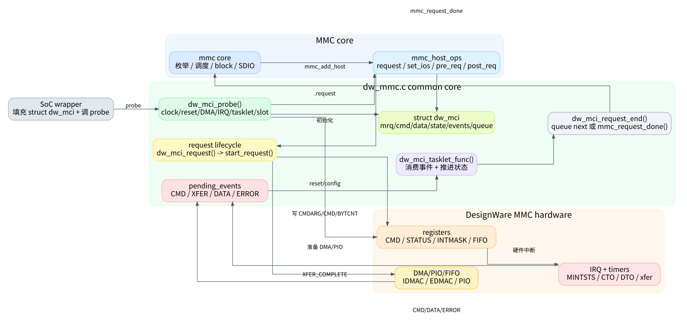

# dw_mmc.c 从 0 吃透：阅读路线

这组文章的目标不是把 `kernel/drivers/mmc/host/dw_mmc.c` 画成一张大而全的状态图，而是让第一次读这个驱动的人能够建立稳定的心智模型：谁调用它、它如何注册到 MMC core、一个请求怎样从命令走到数据再结束、IRQ/timer/tasklet 怎么分工、DMA/PIO/时钟/电源各在什么位置介入。

建议按顺序读。不要从 `dw_mci_tasklet_func()` 开始硬啃；这个函数只是“事件消费者”，如果不知道请求如何进入、事件从哪里来、`XFER_COMPLETE` 和 `DATA_COMPLETE` 为什么不是一回事，状态机会显得非常晦涩。

## 文章清单

| 篇章 | 解决的问题 | 关键源码入口 |
|---|---|---|
| [00. 先建立心智模型](00_mental_model.md) | 这个驱动在 Linux MMC 栈里处于哪一层，文件里有哪些“子系统” | `kernel/drivers/mmc/host/dw_mmc.h:21`, `kernel/drivers/mmc/host/dw_mmc.h:58`, `kernel/drivers/mmc/host/dw_mmc.c:1884` |
| [01. probe 与 host 注册](01_probe_and_host_registration.md) | 设备起来时做了什么，MMC core 最终能调用哪些方法 | `kernel/drivers/mmc/host/dw_mmc.c:3564`, `kernel/drivers/mmc/host/dw_mmc.c:3144` |
| [02. 一个 request 的生命周期](02_request_lifecycle.md) | 一次读写请求如何排队、启动、发命令、准备数据、结束 | `kernel/drivers/mmc/host/dw_mmc.c:1469`, `kernel/drivers/mmc/host/dw_mmc.c:1363`, `kernel/drivers/mmc/host/dw_mmc.c:1967` |
| [03. 数据路径：DMA、PIO 与 FIFO](03_data_path_dma_pio.md) | 为什么有的请求走 DMA，有的回退 PIO，数据完成到底指什么 | `kernel/drivers/mmc/host/dw_mmc.c:1128`, `kernel/drivers/mmc/host/dw_mmc.c:1187`, `kernel/drivers/mmc/host/dw_mmc.c:2810` |
| [04. IRQ/timer/tasklet 状态机](04_interrupts_timers_tasklet.md) | 状态机每个状态等什么事件、消费后去哪、错误路径如何收尾 | `kernel/drivers/mmc/host/dw_mmc.c:2171`, `kernel/drivers/mmc/host/dw_mmc.c:2943`, `kernel/drivers/mmc/host/dw_mmc.c:3326` |
| [05. 时钟、电源、CMD11 与 SDIO IRQ](05_power_clock_voltage_sdio_pm.md) | `set_ios()`、`setup_bus()`、电压切换和 SDIO 中断为什么会影响状态机 | `kernel/drivers/mmc/host/dw_mmc.c:1498`, `kernel/drivers/mmc/host/dw_mmc.c:1250`, `kernel/drivers/mmc/host/dw_mmc.c:1638` |
| [06. 调试与读代码方法](06_reading_and_debugging.md) | 卡住时看哪些 debugfs 节点、状态值如何解码、如何缩小范围 | `kernel/drivers/mmc/host/dw_mmc.c:132`, `kernel/drivers/mmc/host/dw_mmc.c:2037`, `kernel/drivers/mmc/host/dw_mmc.c:1817` |

## 读者应该先记住的 6 个事实

1. `dw_mmc.c` 是 DesignWare MMC host 的通用核心，具体 SoC wrapper 负责创建并填充 `struct dw_mci`，然后调用 `dw_mci_probe()`。
2. MMC core 只通过 `mmc_host_ops` 进入这个文件，例如 `request`、`set_ios`、`start_signal_voltage_switch`、`enable_sdio_irq`。
3. 请求状态机由 `host->state` 表示；事件由 `pending_events` 传给 tasklet；IRQ 和 timer 都只是事件生产者。
4. `EVENT_XFER_COMPLETE` 表示内存/FIFO/DMA 这侧数据搬完了；`EVENT_DATA_COMPLETE` 表示控制器看到卡侧 data over。二者不是同一个事件。
5. `CMD11` 有特殊两段式状态：命令完成后不是立刻回到 `IDLE`，而是进入 `STATE_WAITING_CMD11_DONE`，等待后续 `set_ios()`/clock 流程收尾。
6. 读懂错误路径时，先问三件事：命令错了还是数据错了，当前是读还是写，是否还需要 stop/abort。

## 发布说明

这套文章发布前已经做过本地质量检查：文章文件齐全，SVG 引用存在，源码行号在当前 `dw_mmc.c/.h` 范围内，无占位符残留。公开页面只发布文章、图和静态站点文件；本地自检脚本不作为阅读内容发布。
